### 摘要

财险市场近年增速放缓至10%水平，市场主要以车险为主，占据65%的市场规模；竞争格局较为集中，龙头险企中国财险（即人保财险）常年稳占33%以上份额，其次为平安产险、国寿产险、太保财险、大地财险等。财险公司的盈利模式包括承保盈利与投资收益，ROE可拆分为承保杠杆、投资杠杆、综合成本率、投资收益率等因子。由于财险企业负债久期短于资产久期，所以财险业务的增长情况受宏观和利率周期影响有限，但是监管周期是决定财险企业承保盈利的最主要驱动因素——在监管严格的时期，行业综合成本率较低，险企盈利能力有所保障，龙头企业受益更大，市场集中度上升。中长期来看，中国新车销量增速的下滑会对车险业务造成拖累，另一方面，车险行业竞争持续加剧倒逼行业加大非车业务投入，同时国家政策推动非车险业务的开展，所以财险中的非车险品种有望会成为未来财险行业增长的主要来源，如农险、意外伤害险、责任险等。

寿险市场增速下滑，2019年同比增长在8%。在15年以前，储蓄型保单占比较大（如分红险、万能险），但近年来保障型保单占比不断提升（如定期寿险、终身寿险、长期健康险）。龙头寿险企业包括国寿、平安人寿、太保人寿、华夏人寿、太平人寿、新华人寿、泰康人寿和人保寿险（即老七家+华夏），其中位居首位的中国人寿市场占有率约20%（近年来有所下滑）。代理人渠道是寿险业务最主要的渠道，老七家近十年来稳定占据将近90%的渠道市场份额，在金字塔型代理人团队的建造上，老七家具有先发优势，预期未来行业格局依然保持稳定。寿险的盈利模式包括利差、死差与费差。这三者共同决定寿险企业的利润。影响寿险企业的估值因素包括长期利率、A股表现、内含价值增速、利润与分红，以及风险治理水平等因素，预期未来寿险估值体系将更加重视OPAT与分红。长起来看，寿险市场增长有所放缓，代理人扩张承压，但是中国健康险和寿险潜在需求空间依然巨大。

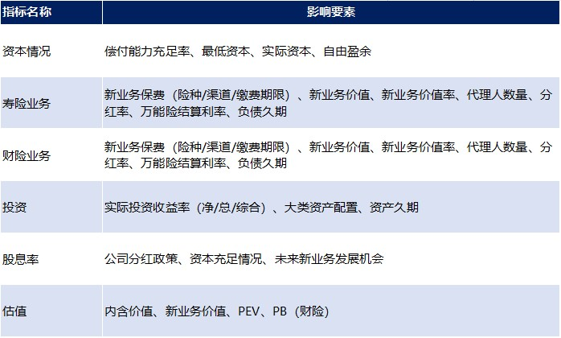

### 财险行业

#### 1. 行业发展

**财险市场规模增速放缓，2018年为10%；车险占据67%财险市场份额，车险市场2018年规模增速为7%。**过去10年财险行业保费规模稳步增长，2018年行业总保费收入达10,770亿元；但自从2010年，保费收入的同比增速则呈现下滑趋势，从2010年的35%逐步下降至2018年的10%。从财险市场的险种结构来看，目前财险的险种以车险为主，2018年车险保费收入占比66.5%；其次是保证保险（约5%）、责任保险（约5%）和农业保险（约5%）。车险市场方面，自2016年以来中国新车销量增速放缓已开始拖累车险保费增速放缓，2018年行业车险保费同比增长仅7%。

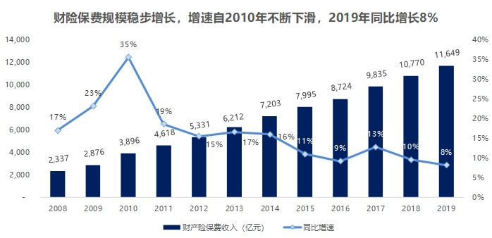
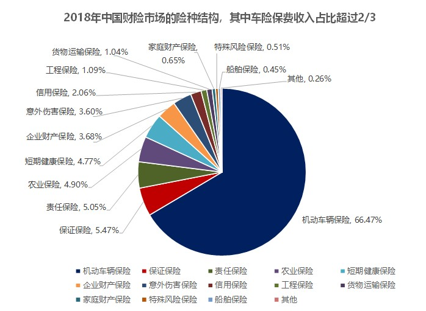
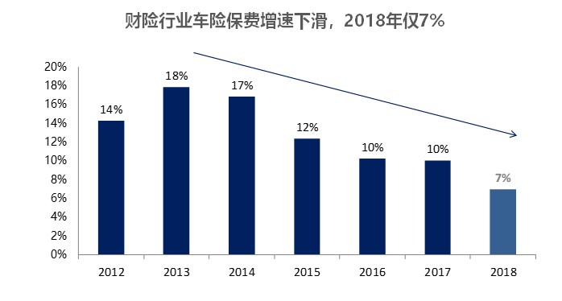

#### 2. 盈利模式

**财险公司的利润主要来源有两个：1）业务端的承保盈利，2）投资端的投资收益。**

1）业务端的承保盈利：公司保单的保费收入与管理费、手续费及实际的赔付费之间的差额。该部分盈利和综合成本率（COR, combined operating ratio）息息相关，当业务端综合成本率低于100%时意味着该笔**业务的赔付支出与预计费用的总和低于收取的保费**，即形成承保盈利，反之形成承保亏损。

2）投资端的投资收益：保户缴纳的保费不是保险公司的资产，在财务报表中应列入负债，属于公司的债务，当保户出险时需拿出来付给保户进行理赔。这些客户缴纳的保费资金，保险公司在留有一定比例的近期理赔或支付金额之后，其余的拿出去进行投资的，投资的收益即投资利润。由于财险多为短期险种，公司在定价时大多不考虑投资收益率，因此资金实际的投资收益全部进入利润，无需再与定价假设比较（这是与寿险的区别，寿险需要与假设比较，利差才是利润）。

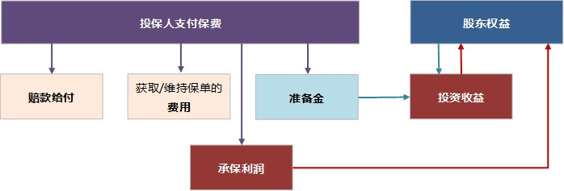

对财险公司的盈利能力进行如下分解：财险ROE=（承保盈利+投资收益）/净资产=（承保杠杆x（1-
综合成本率）+投资杠杆x投资收益率）x（1-税率）。其中承保杠杆=已赚保费/净资产，投
资杠杆=投资资产/净资产。**可见，影响财险业务盈利的重要因子是：承保杠杆、投资杠杆、综合成本率、投资收益率。**

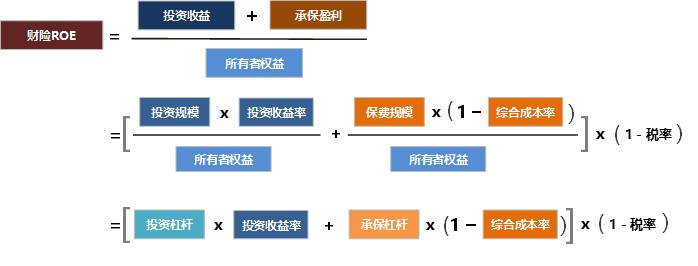

#### 3. 竞争格局

财险行业竞争格局较稳定，在过去5年，前5大公司（人保财险、平安财险、太保财险、国寿财险、大地财产）的合计市场份额维持在65%~68%之间，其中龙头人保财险的市场份额稳定在33%左右。

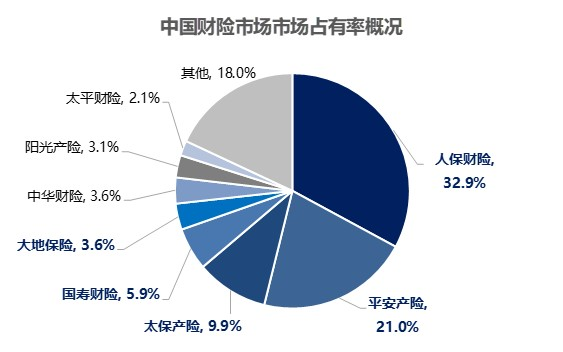
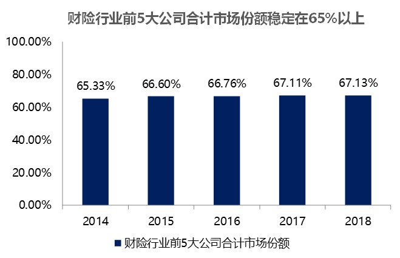
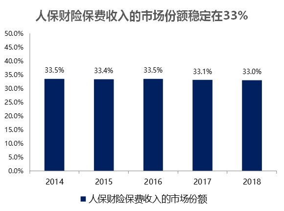

财险市场中，车险业务占据60%以上的收费收入，因此我们重点来看一下车险。车险市场中，人保车险和平安车险占据了超过50%的市场份额，其中人保车险市占率在30%-35%水平，平安车险的市占率在20%-25%水平。在2012至2018年，人保财险的车险市占率有所下降，而平安车险的市占率有所提升。

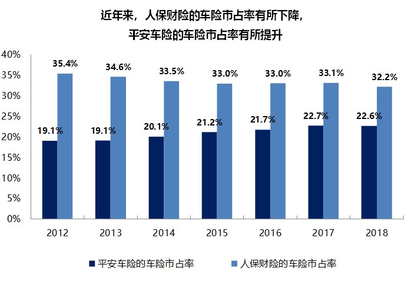

#### 4. 影响因素

**财险业务受宏观和利率周期影响有限，监管周期是决定中国的财险企业承保盈利的最主要驱动因素。**

财险业务特点：

+ **受政策变化与监管周期影响大。**中国地区财险行业的承保盈利主要取决于政策变化（如责任险和农险相关政策）和监管周期（如车险价格管制和手续费监管），受宏观经济影响总体有限；
+ **受长端利率下行的冲击较小。**在长端利率下行背景下，负债久期短于资产久期的财险业务资产负债表并不受冲击，相对寿险和其他金融子行业更有优势。

##### 最主要驱动因素：监管周期

监管周期是决定中国车险承保盈利的最主要驱动因素。**监管政策对行业综合成本率的影响：价格管制或严监管下，车险行业综合成本率一般会处于较低水平，大型财险公司的综合成本率表现更加优秀，市场份额通常会提升。**

历史上车险的监管周期：

+ 2001年之前，银保监会统一规定车险定价，是车险“价格管制”时代；
+ 2001-03年，银保监会开始尝试放开车险定价，并在广东开启试点；
+ 2003-06年，银保监会在全国范围内放开车险定价；
+ 2006-08年，银保监会再次统一车险定价，车险行业重新回到“价格管制”时代；
+ 2008-11年，银保监会继续加强对车险市场（尤其是手续费）的监管；
+ 2011-15年，银保监会在2012年提出下一轮费改“三步走”的方针，对车险市场的严监管持续；
+ 2015年至今，银保监会开启第二轮费改周期。

在价格管制和费用监管加强的周期中，车险行业综合成本率将会呈现下行趋势，大型保险公司的市场份额通常会提升：

+ 2003-07年，由于车险定价放开，各保险公司进入“价格战”，2007年行业综合成本率大幅提升至111.4%，前三家合计市场份额从80%大幅下降至67%；
+ 2008-11年，在价格管制和严监管下，行业综合成本率大幅下行至2011年的95.3%，前三家合计市场份额稳步回升，从64%提升至67%；
+ 2012-15年，由于新牌照增加、资本持续流入行业，财险公司竞争有所加强，但在严监管之下行业综合成本率稳定在99~100%的水平，前三家合计市场份额略微下降；
+ 2015年至今，第二轮费改开始，但在银保监会的严监管且渐进改革的策略下，行业综合成本率基本保持稳定，前三家合计市场份额略有回升。

监管加强周期有利于头部险企（如中国财险）的承保利润。在价格管制和费用监管加强的周期中，来自中小公司的非理性竞争受到很大遏制，头部险企的车险业务可持续带来稳定的承保盈利，从而推动公司业绩表现上行。

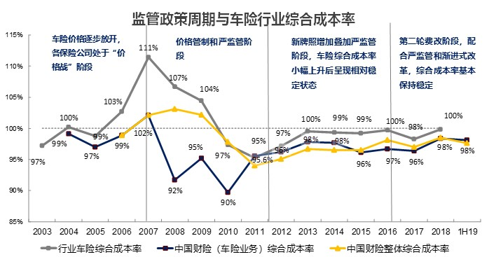
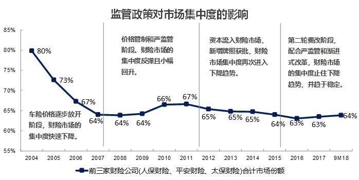
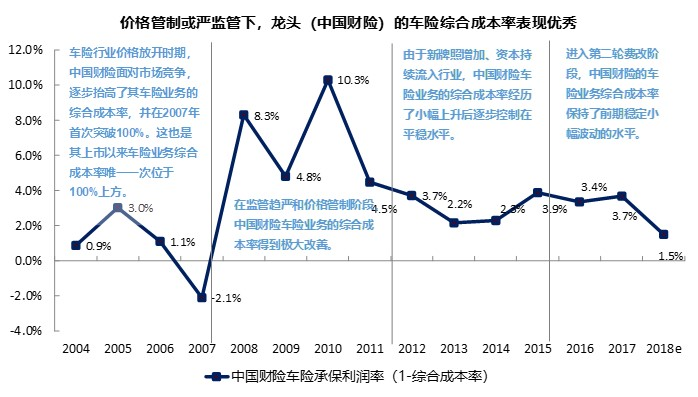

##### 影响很弱的因素：长端利率

在长端利率下行背景下，负债久期短于资产久期的财险业务更有优势。

以中国财险为例，财险公司的负债久期平均为约1年，资产久期平均为4至5年，因此负债久期小于资产久期。这与寿险公司普遍负债久期大于资产久期的特点明显不同。在利率下行环境下，中国财险等财险企业的投资端对利润的敏感性更低。基于公司的资产配置策略、比例、各类资产的收益率预期以及负债久期小于资产久期的特点，预计公司未来可获得稳定的4.5%投资收益率，稳定性强于寿险公司。

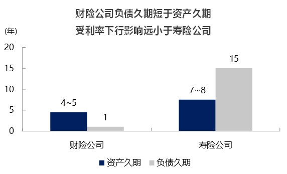

#### 5. 未来判断

**中长期来看，车险增速长期面临压力，非车险会是财险市场下一个增长引擎。**自2016年以来中国新车销量增速放缓已开始拖累车险保费增速放缓，这一趋势将在未来3年也将会持续，这也意味着财险市场中占据65%以上收入份额的车险业务增长将会随之放缓。另一方面，非车险将会成为未来财险行业增长的主要来源，这是由于：1）车险行业竞争持续加剧倒逼行业加大非车业务投入；2）国家政策推动：2017年开始中国非车险保费开始显著加速，2015年-2018年复合增速为18.8%，超过车险保费的复合增速10.6个百分点。

##### 2020年车险保费增速低单位数正增长

自从第三次车险费改在3Q18在三个地区试点以后，2019年至今暂无进一步的推进。但2020年继续推进车险费改的外部条件已经初步成熟：
+ 2019年的手续费严监管已经推动行业的承保盈利水平显著恢复，为未来费改带来的镇痛预留了安全垫；
+ 先行试点第三次费改的地区运行结果好于预期：尽管保费下降，但是COR的改善驱动承保盈利稳中有升。

如果第三次车险费改在全国推开，则整个车险市场有较大的负增长压力。

**如果不考虑第三次车险费改继续推进，预计2020年车险保费增速保持低单位数正增长。**

+ 新车销量增长持续低迷，但是总的车辆持有量保持增长；
+ 2015-18年车险费改带来的单均保费的持续下降趋势缓和；
+ 2019年严监管导致的大公司区域机构停业影响基本出清。

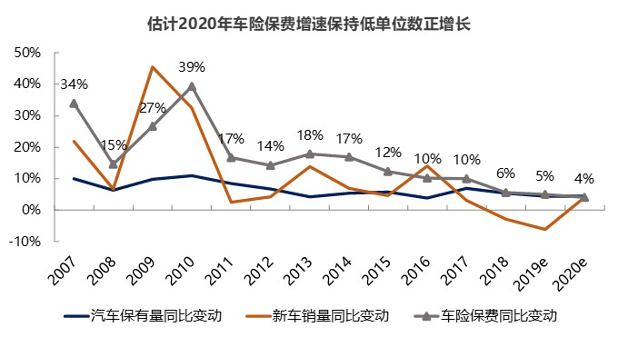

##### 车险承保盈利能力（COR）继续改善

通过上述监管周期与车险承保盈利能力（COR）之间关系的分析，在监管趋严的情况下，预计财险企业COR继续改善:

+ 手续费严监管持续，利好大型头部险企，行业竞争格局改善；
+ 2018年高手续费对于COR的递延负面影响出清。

##### 非车险保费是下一个增长引擎

非车险将是未来财险行业增长的主要来源。

+ 车险行业竞争持续加剧倒逼行业加大非车业务投入；
+ 国家政策推动。

2017年开始中国非车险保费开始显著加速，2015年-2018年复合增速为18.8%，超过车险保费的复合增速10.6个百分点。

1）农险：近年来政府对于农险发展重视程度显著提升，2014-2018年中国农险保费复合增速11.9%。我们认为中国农险市场的覆盖率/渗透率仍然过低，2015年中国农险保障水平（单位面积保额/产值）仅为18%，相对美国的50%仍有较大差距，未来增长空间较大。2015年至2018年人保财险农险业务的市场份额始终保持在45%以上，在农险市场中占据主导地位。

2）意外伤害和健康险：公司的意外伤害和健康险主要为大病保险。大病保险是在基本医疗保障的基础上，对大病患者发生的高额医疗费用给予的进一步保障。近年来，国家加大对大病保险的财政支持力度和政策支持力度，有利于推动其快速增长。

3）责任险：中国政府高度重视在重点行业领域引入责任保险机制，出台了大量涉及推动责任保险运用发展内容的工作文件，责任保险的市场空间广阔。近年来人保在生态环境、食品安全、安全生产、医疗卫生等诸多领域广泛开展业务。

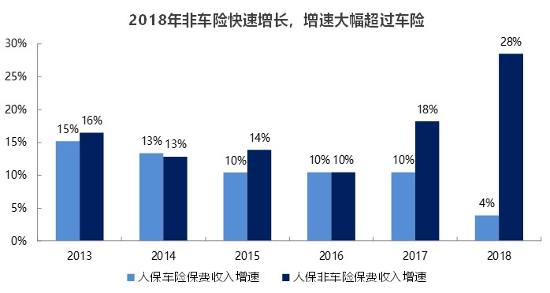

### 寿险行业

#### 1. 行业发展

过去10年寿险行业保费收入稳步增长，2019年行业总保费收入达22,754亿元，同比增长10%。据保险统计年鉴口径，目前寿险（此处为纯寿险，不包括健康险）的险种以普通寿险和分红寿险为主，二者2018年保费收入占比分别为43.92%和55.53%。

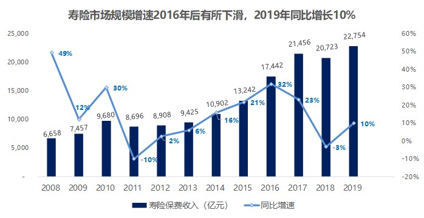
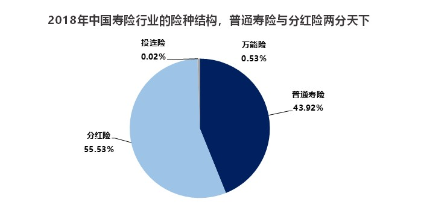

**从寿险产品结构历史来看，我国寿险市场由储蓄类保单长期主导，2015-19年保障类保单占比逐渐提升。**按照商业实质，保单可分为保障型产品（健康险、终身寿险和定期寿险等）和储蓄型产品（年金、两全险等）。2011-2015年之前储蓄型为主要产品类别，保障型占比很低，在10%的水平。自2015年开始，保障型产品占比逐渐提升，2018年平安、新华、太平的保障型产品占新单的比例已经分别为46%、59%、38%。

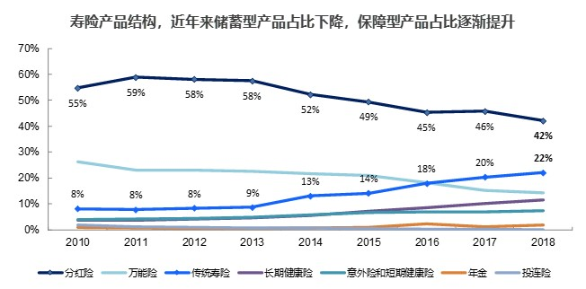
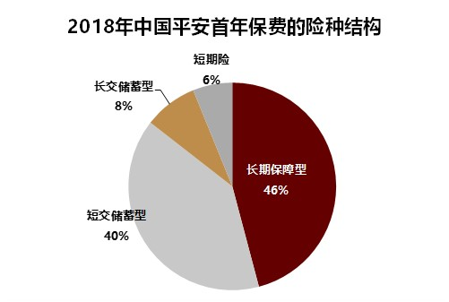

2015年以来，保障型产品占比不断提升，背后原因包括偿二代实施、监管导向、自发性保障需求。

+ 监管导向：近年开始监管强制推动保险行业回归保障，限制储蓄型、鼓励保障型。如2016年禁止销售中短存续期产品，2017年禁止销售快返型年金。

+ 自发性保障需求：中国寿险潜在客户的教育水平和支付能力提升、医疗费用增速显著高于社保覆盖扩张速度。

+ 偿二代实施：2016年中国保险公司开始实施偿二代。偿二代下保障型保单不仅不占用资本，甚至还可以贡献资本，间接驱动行业集中发展保障类业务。

**未来长期来看保障型增长空间依然巨大。**从各项指标来看（保障缺口、保险深度密度），中国寿险市场仍处于发展初期，和海外市场差距明显；中国寿险需求端方面，预计随着数量更大、受教育程度更高、收入更高的80后和90后年龄段人口逐步跨入中产阶层，中国寿险的核心客户群将快速增长，推动寿险需求未来10年持续稳健增长。

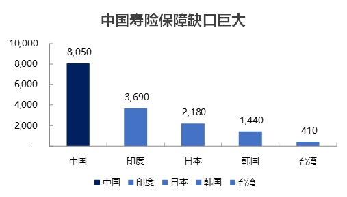
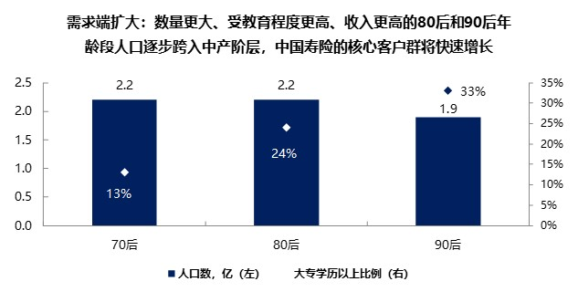

#### 2. 盈利模式

寿险产品盈利来源：死差、利差和费差，寿险公司在定价时会分别假设未来投保人的死亡率及疾病发生率、保险人收到保费后进行投资可实现的投资收益率、保险公司获取以及维护保单的费用率，当实际的死亡率或疾病发生率低于定价假设、投资收益率高于定价假设、费用支出低于定价假设会分别形成三差收益，反之形成三差亏损。

+ 利差：保险期间内保险公司实际要支付给保户的保单价值的利息与保险公司实际投资收益之间的差异。支付给保户的利息是险企的营业成本，属于险企的负债端；投资收益是险企的营业收入，属于险企的资产端。两者都是由保费衍生而来，收入与成本的差异就是险企的利润。由实际付给客户的利息与实际投资收益共同决定利差的大小。
+ 费差：保险公司在保单定价时，会预估的手续费、管理费等支出并在此基础上预留一定利润，即产生定价费用率，这与公司经营中实际支出的费用率之间的差异就是费差。
+ 死差：保险公司在保单定价时预估的死亡率、意外及重大疾病发生率并自此基础上预留一定利润的定价赔付率，与未来实际死亡率、意外及重大疾病发生实际赔付的差额。

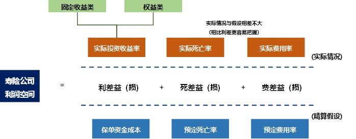

利差的盈利模式与银行存贷款利差模式有相似之处，但区别在于保险合同往往是几十年甚至终身的长期性合同（期限长），同时支付给保户的利息率既有固定的也有浮动的，同时投资收益率是波动的，即投资收益不确定（不确定性大），所以对于保险公司来说是利差可能是正的（利差益），也可能是负的（利差损）。特别是对于保证利率过高的固定利率保单，有可能存在长期的利差损，而成为亏损保单。因此，在衡量保险公司利差收益时，要考虑保单保期内长期的利息成本和长期的投资收益率。

**当期利润＝保费＋投资收益－费用－理赔支出－红利支出－准备金变化**

其中，准备金＝未来支出现值－未来收入现值+不利偏差+剩余边际。准备金假设越保守，初期提取准备金金额越大，利润越往后移动；准备金假设越激进，期初提取准备金金额越小，利润往前移动。

#### 3. 竞争格局

**寿险行业竞争格局较稳定，中国头部八家寿险企业（中国人寿、平安寿险、太保寿险、人保寿、新华人寿、泰康人寿、太平人寿）长期占据主导地位。**在中国市场，寿险企业主要以代理人渠道展业，金字塔形代理人团队的独特商业模式决定了更早开始的公司将具备难以撼动的优势，后来者从零开始建立团队不仅前期投入大,而且成功率很低。这导致代理人渠道竞争格局固化，集中度长期保持高位。在过去十余年，老七家寿险企业与华夏人寿在代理人渠道保费市场份额合计稳定在90%的水平。2018年，头部八家寿险企业合计占据代理人渠道90%的市场份额。当前的竞争格局将会长期持续。

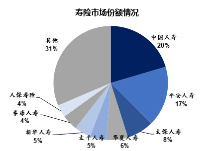
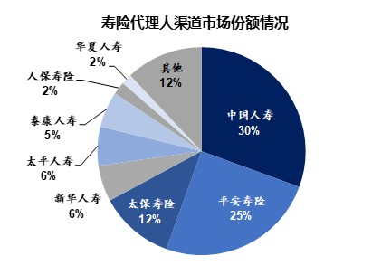

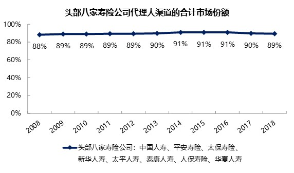

#### 4. 影响因素

##### 长端利率的变化是中国寿险公司中长期最重要的驱动

+ 由于负债端久期长，寿险公司的资产端超过80%的资产为固收资产（包括非标债券）且有久期要求，因此保险资金长期投资收益率的中枢由10年期国债收益率决定；
+ 由于中国寿险公司的负债久期（11-15年）大幅长于资产久期（5-8年），未来长期的国债利率水平决定了保险公司的所有存量保单在未来数十年的盈利/亏损水平；主要注意的是，2016年以来固定利率长久期业务（长期重疾险）占比不断提升，导致资产负债久期的错配缺口加大，间接加大了长端利率的重要性；
+ 长期来看，保险股PEV的中枢取决于市场预期的国债利率的长期稳定水平，如果这一水平低于5%精算假设对应的国债利率水平（3.5%以上），则保险股估值会显著低于1倍PEV，因为市场不认可公司披露的EV。

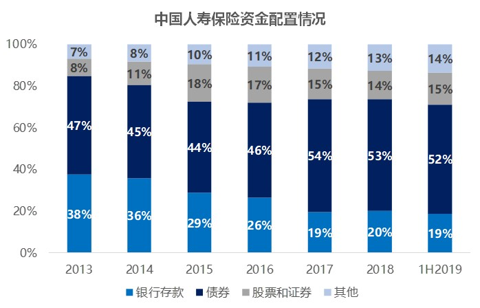

##### A股市场表现是短期最重要的驱动
+ 寿险公司资产端股票配置比例稳定在7%~12%，由于寿险公司本身财务杠杆接近10倍，股票资产的盈亏对于当年的利润有很大直接影响；
+ 由于A股市场对于保险股的影响永远是双击或双杀，因为A股市场向上时，保险股的估值（PEV）和当年盈利均受益，反之亦然；
+ A股市场表现对于保险公司的长期盈利能力影响有限，因为短期的波动并不会影响市场对于保险资金投资A股可获得的长期收益率水平的判断。

##### 新业务价值/新单保费增速
+ 体现了保险行业的成长性和新业务的盈利能力，是中期的重要估值驱动之一，但并非最重要的，不必高估短期新业务价值增长对于估值水平的影响；港股市场对于新业务价值增长的关注程度高于A股市场；
+ 间接决定了内含价值增速的变化：如果新业务价值的同比增速低于上一年内含价值的增速，则内含价值增速将放缓。

##### 内含价值增速
+ 体现了一家寿险公司盈利能力的终极指标：基于同样的精算假设，内含价值的增速越高，综合盈利能力最强，估值也应越高；
+ 每年内含价值增速主要决定于：1）新业务价值贡献；2）预期回报（少折现一年的影响；3）实际投资；4）运营经验（包括赔付经验、费用支出、退保经验等）；5）精算假设调整；
+ 长期估值水平的重要驱动因素，在市场情绪乐观时决定了估值上限。

##### 利润

+ 利润对寿险估值有一定短期影响，但是重要性有限且影响时间较短：这是由于：1）中国会计准则导致寿险公司的利润和实际现金流完全无关，并不能有效反应公司的实际盈利情况；2）寿险公司的利润很大程度收到投资表现（主要是股票决定）和准备金折现率影响，不同年度直接波动很大，因此无法作为一个稳定的估值基础。

+ 中国平安17年开始运营利润（OPAT）概念，即剔除了投资波动和准备金折现率变化影响后的利润。在平安将其分红与OPAT挂钩后，OPAT将会作为一种辅助的估值基础，但是由于OPAT概念本身依然有理论缺陷（和实际现金流完全无关，且完全未考虑资本成本），其重要性依然低于内含价值指标。

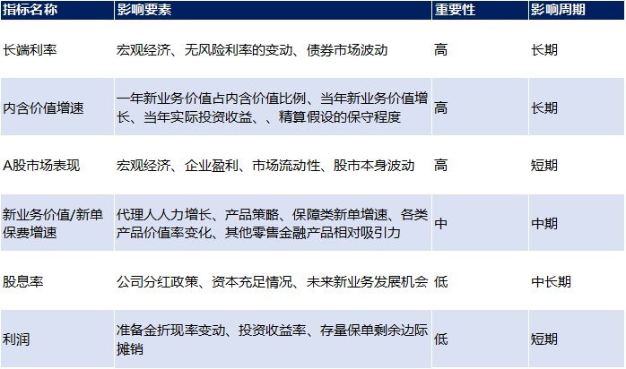

保险股的短期和长期投资策略的关键因素有所不同：

+ 12个月以内，最重要的选股指标是当年新业务价值增速、当年内含价值增速、股票配置比例、机构持仓、相对估值水平。

+ 长期来看（未来1-3年），最重要的选股指标是公司治理风险、内含价值的长期增速、抵御利率长期下行能力（资产负债久期匹配状况）、投资者关系管理能力、披露透明度和相对估值水平。

#### 5. 未来判断

近期来看，我们预计自18年开始持续至今的个险渠道增长压力将在2020年持续，这是基于：1）19年行业人力数量整体收缩（保障类为主的业务结构决定了新人留存困难），这一趋势大概率在20年持续；2）保障类保单（重疾险为主）的单均保费提升空间十分有限，甚至有下降的可能；3）尽管银行理财收益率有所下降，但是寿险产品的监管规定（5年以后才能开始返本）限制了短交储蓄类保单的竞争力；4）由于19年开始销售费用刺激的边际效果十分有限，多数公司在2020年并不会激进的投入费用。

中国健康险和寿险潜在需求空间巨大。1）从和海外市场的对比来看，中国寿险市场仍处于发展初期，和海外市场差距明显。中国健康险保障缺口和寿险保障缺口分别高达8,050亿美元和32,074万元 ，均位居亚洲之冠（Swiss Re），这样巨大的差距提供长期增长空间。2）对于多数中国多数地区来说，寿险市场仍在从0到1的阶段：很多居民仍没有一张商业保单。以人均持有的寿险长险件数来看，中国仅为0.13件（2017），日本、台湾、美国分别为6.5、2.5、5.0件（2018）。

长期来看，随着寿险市场进入中低速增长时期，中国寿险公司将会呈现出与过去十年（2009-2018）高增长时期相当不同的基本面特征：1）新业务增长的长期预期显著下降至低速；2）内含价值增速和利润增速均逐渐放缓；3）新业务增长对资本需求的下降驱动分红水平提升。业务结构方面，自2018年开始，上市公司的新业务中长期保障类业务（非分红）占比接近一半，其余为储蓄类业务（大部分为中短久期年金），我们预计这一结构将在2019年及以后保持基本稳定。我们认为，随着新业务增速有所放缓，估值体系更加关注利润/营运利润，中国寿险公司的高盈利能力将会更好的被市场认可。从更长周期来看（1~3年），具备较高治理水平、具有抵御长端利率下行能力、内含价值转化为盈利的路径清晰、分红水平和盈利转化为分红的路径清晰，以及内含价值/盈利可维持长期高速增长的企业，将得到市场更多的肯定。
