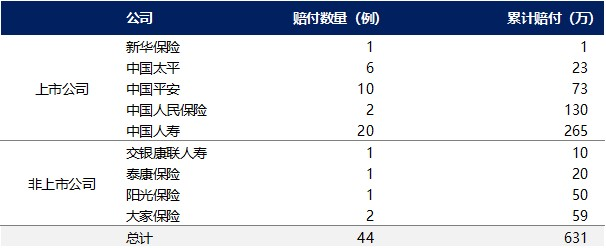

### 摘要

武汉“新冠”肺炎疫情仍在发酵，对实体经济和投资者情绪都有较大影响，但**总体来看，疫情对金融行业的影响会小于对实体行业的影响，因为金融行业更看重存量的价值，所以尽管短期内增量有所减少，但总体不会造成太大冲击。**

对于保险业来说，疫情对行业整体影响的定性判断为：**短期新业务有压力，但中长期影响有限**。1Q20个险新业务销售预计会受到较大影响，全年的业务情况也受到间接的拖累，但不会对行业带来持续性的负面影响。另一方面，疫情的发酵会提升居民的保障意识，但对于保费增长的实际影响不宜高估，毕竟保险行业的供给端影响更大，需求端影响较小。此外，在居民减少户外活动+保险需求增长的背景下，依靠线上销售保单的平台有望短期受益，但并不持续。

---

### 疫情期间：对短期业务的影响主要在销售端，对赔付的影响非常有限

销售端受到负面影响：尽管目前个险渠道的部分展业步骤可以通过线上远程完成，但是部分步骤仍必须线下完成，特别是储蓄类保单。因此**由于疫情造成代理人无法与客户见面的情况，将直接导致短期新单销售受到较大影响**。基于目前的情况，预计2月份行业个险新单同比下降30-40%，3月份或继续同比下降。作为参考，SARS期间，中国人寿2003年上半年的个人新单保费同比下降41%。

赔付的影响有限：由于重疾险保障的病种不包括“新冠”这种新型病毒引发的疾病，且目前因病死亡的大部分案例为老人，该年龄段的商业保险覆盖率总体较低，因此**预计疫情对于保险行业赔付造成的压力有限**。据保险行业协会统计，截至1月30日行业累计赔付为百万元量级；截至2月9日，据统计各家保险公司的赔付数据，因疫情产生的累计赔付未突破千万量级。即使最终赔付数字在此基础上有两个量级的增长，相对于行业每年几千亿元的赔款及给付规模也较为微小（2018年行业寿险的赔款及给付为4388亿元；健康险为1310亿元）。

### 疫情受控后：销售将显著恢复，对健康险产品有推动作用

**短期来看，预期公司会调整业务节奏并放宽标准维持人力稳定，疫情受控后新单增速应有显著回升。**在疫情不断发酵期间，保险公司会基于疫情状况调整业务节奏，如延长或推后原定的开门红产品投放、费用投放计划，同时暂时放宽人力考核标准和增加费用激励以维持人力稳定，这将有利于疫情受控后比增速反弹，部分填补2-3月份新单的下降的缺口。作为参考，对照2003年的行业保障型产品（寿险+健康险）保费收入情况：非典期间，总保费收入在短期反弹后增速由高位逐渐下行。需要注意的是，由于开门红期间的新单下降会影响代理人收入，进而影响留存和增员，预计这也会对全年的新业务增长造成一定拖累。

**中长期看，事件有利于提高居民对健康险的认知，但不宜高估所造成的影响。**疫情或对提升居民的保障意识或有一定帮助，但是这并不会直接对大公司寿险或健康险业务的新单增长带来帮助，这是由于寿险大公司新业务的增长主要决定于供给端（代理人数量与产能），而需求端（保障意识提升）变化造成的直接影响有限。

### 保险需求短期有可能溢出至线上渠道，但对行业经营格局影响有限

**疫情会导致部分保险需求短期溢出至线上渠道，但是头部保险机构在资本、渠道、市场份额等的控制力在金融各板块中更强，所以即便短期线上渠道业务收入有所增长，但在疫情受控后将回归代理人渠道为主的状态，行业竞争格局依然稳定。**

如图，互联网渠道保费收入在2012-2015年的4年间曾经历高速增长（保费收入规模增长近20倍），线上保费收入占比在2015年达到了9.2%。然而从2016年开始，线上保费收入逐年下滑，2018年渗透率不足5%。反观寿险业务中代理人渠道，前7家公司的总计市场份额连续10年维持在90%的水平，具有难以撼动的市场地位。因此，行业中长期的竞争格局不会因此而改变。

---

### 英文版提炼

The novel coronavirus pneumonia ("NCP") outbreak has had a major impact on the real economy and market sentiment. We believe the financial sector will be less affected than the real economy. For the insurance industry, NCP outbreak may cause short-term sales to face pressure, but its long-term impact should be limited.

**Sales pressure in short-term.** Savings-type policies need offline confirmation, and the fact that many agents are not meeting clients during the NCP outbreak will lead to a decline in short-term sales. We thus expect personal insurance sales to fall 30–40% YoY in February and to drop further in March. For reference, China Life’s new personal premium in 1H03 dipped 41% YoY due to SARS outbreak. 

**Limited impact on claims.** NCP is not covered by critical illness insurance, and the penetration rate of commercial insurance is low among the elderly who are more susceptible to infection. We therefore think the virus will not lead to a marked increase in insurance claims. According to the Insurance Association of China, claims for the NCP totaled Rmb1mn as of January 30, a small amount compared to Rmb438.8bn in claims for life insurance and Rmb131bn claims for health insurance in 2018. 

**After the NCP is contained, sales may markedly rebound.** We expect insurers to defer their new product launches and adjust performance evaluation criteria to retain agents, and such efforts can boost sales growth recovery after the virus is contained. However, insurers may find it difficult to retain and recruit agents whose salaries are based on sales, and this might drag sales growth in 2020 by 3–5% (assuming the growth in the number of newly-infected patients is not as rapid in mid-February). 

**In the mid/long term, NCP’s impact on life insurance is limited.** We believe the virus will raise people’s awareness of insurance, but it will not directly boost life insurance sales, mainly because sales of such policies mainly depend on supply (number of agents and their sales efficiency) rather than demand. 

**Impact on competitive landscape limited.** Top insurers are more competitive in capital, channels, and market shares than their smaller rivals. The NCP will increase online insurance sales in the short term, but agents will remain the major sales channel after the virus is contained.

