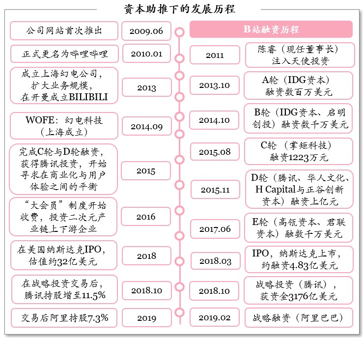
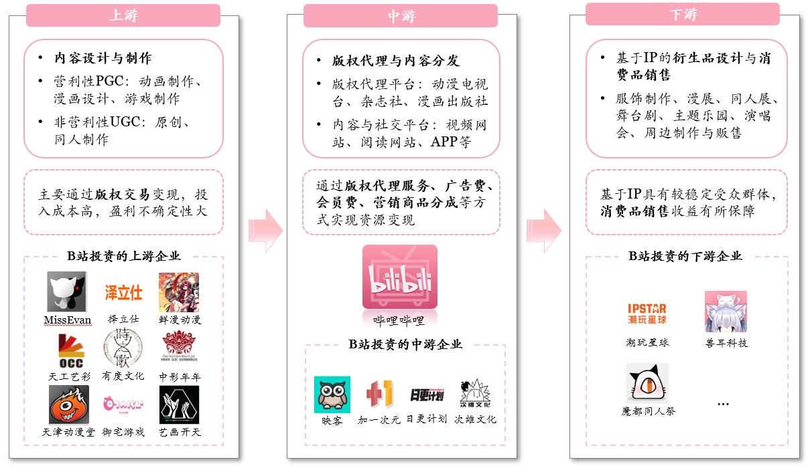
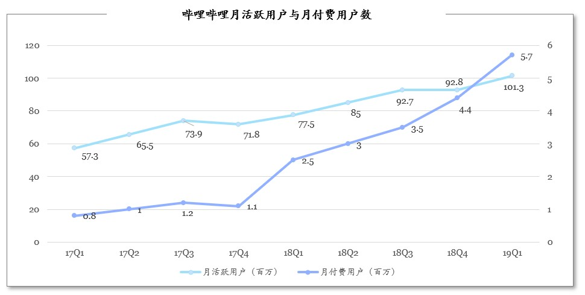
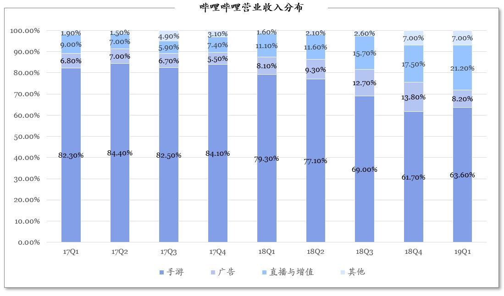

### 摘要

哔哩哔哩，又称“B站”，自2009年6月创立，在资本的一路助推下逐步崛起，打败了竞争对手A站，成为国内领先且独特的视频分享与交流社区，于2018年3月登陆纳斯达克上市。在上市后的一年内，先后引入腾讯与阿里巴巴的战略投资，在商业模式的探索道路上发挥更强的协同效应。初创时定位于打造ACG（动漫、漫画和游戏）内容的视频社区，在发展过程中进行横向与纵向的延伸——横向支持呈现多元化内容，纵向积极布局二次元产业链，扩大用户群体，并提升用户粘性。

2019Q1财报B站公布新的成绩，MAU同比增长31%达1.013亿，成为月活过亿的超级app。一季度营收13.7亿元，营收同比增长58%超预期，也远远超出互联网行业20%到30%的平均增速。同时，营收结构得到了优化，四驾马车并驾齐驱——游戏、广告、直播+增值业务、电商，其中游戏的营收占比呈下降趋势，而直播和增值服务具有成长为一大营收主力的趋势。

然而，在2019Q1喜报的背后，忧患依然重重。一季度净亏损同比扩大239%，亏损扩大幅度远超营收增幅，此外，毛利率连续三个季度下滑，2019一季度毛利率14%是自2017年第一季度以来最低水平。成本的增速高达81%，超过2018年4个季度的平均水平，主要支出增长来自于运营支出。业务方面，手游收入虽然继续增长，但主要是因为爆款游戏FGO，若要维持增长则急需寻找下一个爆款游戏，另外广告业务增长不及预期（尤其是品牌类广告），B站需要扩大广告的兼容性。

总体来看，B站的表现仍然给投资者带去长期的信心，随着用户的扩大、粘性的增加，B站可以更多从手游、直播与增值服务、广告与电商等业务角度，全方位探索商业变现渠道。

### 目录

+ Part1 资本助推B站崛起，成为国内领先且独特的视频分享与交流社区
+ Part2 B站布局，横向支持呈现多元化内容，纵向积极布局二次元产业链
+ Part3 2019Q1有喜有忧，整体表现仍然给投资者带去长期的信心
+ Part4 四类业务并驾齐驱，全方位探索商业变现渠道
+ Part5 结语

### 资本助推B站崛起，成为国内领先且独特的视频分享与交流社区

哔哩哔哩创建于2009年6月，以视频运营为核心，提供游戏、直播及虚拟增值服务与广告等多样化业务，号称“B 站”。初创时定位于打造ACG（动漫、漫画和游戏）内容的视频社区，目前已拓展到更多垂直内容行业，如生活、科技及娱乐等，收获更广泛的目标用户群体，成为国内目前最大的二次元交流平台的同时也成为领先的视频分享与交流社区。

B站在资本市场的格外青睐中实现高速发展，在2013年至2017年经历了A至E轮共5轮融资，随后于2018年3月28日在美国纳斯达克IPO。上市后一年内先后引入腾讯与阿里巴巴战略投资，集腾讯与阿里两大巨头，发挥协同效应，包括视频版权、分发渠道，尤其内容变现方面：游戏业务一直是B站营收结构中的主力，与腾讯协同性较强；在与阿里联手后，二次元周边电商很可能会是B站未来拓展新业务的有效突破口，可深度挖掘Z世代群体的商业价值。

### B站布局，横向支持呈现多元化内容，纵向积极布局二次元产业链

二次元产业链围绕IP展开，覆盖动画、漫画、游戏、小说、影视及周边娱乐产品。产业链的上游主要进行内容设计与制作，包括营利性PGC（动画制作、漫画设计、游戏制作）以及非营利性UGC（原创、同人制作），商业模式主要是通过版权交易变现，但上游的投入成本高、盈利不确定性大。产业链的中游主要进行版权代理与内容分发，中游厂商包括常见的版权代理平台如动漫电视台、杂志社、漫画出版社，以及常见内容与社交平台如视频网站、阅读网站、APP等，变现模式主要是收取版权代理服务费、广告费、会员费、营销商品分成等。产业链的下游主要进行基于IP的衍生品设计与消费品销售，如服饰制作、漫展、同人展、舞台剧、主题乐园、演唱会、周边制作与贩售，考虑到IP具有较稳定受众群体，因此下游消费品销售收益有所保障，风险较低且盈利性较强。

B站纵横布局，覆盖更多受众的同时提高用户粘性。

+ 横向拓展：丰富二次元产出的同时，扶持国产漫画、引进日本漫画番剧等；泛化覆盖古风、舞蹈、鬼畜等内容。
+ 纵向扩展：积极利用投资布局产业链，已投资60余家二次元行业上下游企业，包括动漫游戏制作、直播与周边娱乐产品等，覆盖天使轮到中后期各阶段。

### 2019Q1有喜有忧，整体表现仍然给投资者带去长期的信心

+ **用户基石：流量出现货币化趋势**

2019年一季度MAU达1.013亿，同比增长31%，成为月活过亿的超级app；月付费用户达到570万，同比增长132%。月活跃用户与月付费用户比值20:1，表明流量逐渐货币化，社区为优质内容付费意愿上升。此外，日均视频播放量5.1亿，同比增长93%，月均用户互动量（评论、弹幕、私信、投币等）14亿，同比增长361%，表明用户参与社区建设的积极程度上升，互动习惯养成有利于社区内容的多样性以及用户粘性的增强。总体来看，不仅流量规模在提高，B站的用户粘性也同样在提高，而用户付费意愿也在增强，呈现积极的流量变现趋势。

+ **现金为王：充沛资金支撑发展**

B站2019年一季度的净现金达到了35亿人民币，加之过去一年的融资（IPO、腾讯与阿里的战略投资），企业的现金流十分充沛，足以支撑下一步的内容生产激励、算法优化等等进一步发展。

+ **盈利能力：多元化业务结构形成**

2019年一季度手游收入继续增长，主要是因为爆款游戏FGO的支持，倘若需要维持手游业务的收入规模则迫切需要寻找下一个爆款游戏。手游收入占比方面，2018年一到四季度，游戏营收占比分别为79.38%、76.92%、68.5%和62%，从接近80%的高度依赖程度逐渐减少，2019年一季度占比为63.6%，可见已基本稳定在70%以下，营业收入解除了对手游业务的依赖，呈现出多元化的业务模式。广告业务增长不及预期（尤其是品牌类广告），同时在收入结构中的占比出现较大幅度下降，B站需要扩大广告的兼容性，吸引更多的高质量广告主进行投放。直播与增值业务收入达到2.9亿元，在营收结构中占比逐步稳定提升，巩固了二次元文化和游戏的核心优势，虚拟主播成为增长亮点。此外，在于阿里巴巴联手后，B站的电商及其他收入首次突破1亿元，成为未来盈利增长的新发力点。

### 四类业务并驾齐驱，全方位探索商业变现渠道

基于B站业务的多元化结构形成，可以分别从不同类型的业务中寻求流量变现：

+ **手游**

过去三年ACG 手游市场占手游市场总规模逐年上年，表明市场对ACG手游关注度提升，竞争加剧，B站优势在于积累大量用户数据和独特高粘性社区，可挑选受欢迎的ACG IP进行手游发行。

+ **直播与增值服务**

利用游戏直播来导入流量，同时利用秀场类直播增加收入；B 站在直播品类上具有“虚拟主播”和“语音主播”的特殊竞争优势，可基于自己的高人气虚拟IP（如洛天依等）进行价值挖掘。

与爱奇艺等类似，平台以一定成本获得内容的分发权后，向用户收取会员费，会员可以比普通用户优先观看最新动画动漫，也可以免费观看一些付费剧集。

+ **广告**

适当放置优质广告，可借鉴youtube对广告的处理（5秒后可自由选择是否继续看广告）；通过算法技术实现有效广告分发提高销售效率，增加对广告主的吸引力有利于提升广告单价。

+ **电商（其他）**

增加ACG 相关周边产品的宣传与销售，如漫展门票等；建立从阿里巴巴采购产品并由UP 主进行宣传的合作模式（去年双十二，淘宝二次元市场增长达到90%，七家二次元店铺成交过百万）。

### 结语

B站最大的优势来自于对年轻用户中的影响力与包容性，尤其对Z世代（1990-2009 年出生的人群）。随着这一代人一批批进入社会，为B站优质内容付费的能力与规模也预期会逐渐增加。其次，B站起家的独特之处在于“发弹幕”，这一新型的分享与交流模式使得原本许多枯燥的内容变得更有趣，使得B站从一般的视频平台脱颖而出，成为一个分享与交流型的视频社区。通过发弹幕、评论、私信、赠送虚拟礼物的方式提升用户参与度，B站构建了独特的、幽默的、愉悦的社区氛围，形成公司业务的强大护城河。

*参考资料：哔哩哔哩招股书，哔哩哔哩公告，哔哩哔哩财务报告，IT桔子，清科研究中心，天眼查，CNG*

---

写在最后：

其实我不是ACG的拥护者，甚至为人们对二次元的沉迷感到不解，但我是B站的忠实用户，也以对B站的体验与了解作为谈资，幸运地拿到一份专注TMT行业咨询公司的日常实习offer，也算是和B站有缘分。在2019Q1财报，B站提到用户日均使用时长为81分钟，这其实一点不为过。首先，UGC本来就是集众人之力挑选出来的一些精选内容，更新快、质量高，加上弹幕的加持，一切都是这样的新鲜有趣，让人流连忘返。其次，日渐精进的内容分发算法，一个接一个的推荐视频都是如此和我胃口，不知不觉便一个接一个划着看下去（就比如今天下午看了好久李现和杨紫的撒糖cut，老阿姨要甜晕过去了）……看B站报表的时候，利益相关最大的部分是我买了B站股票但被套了，但是做分析还是要比较中立。最后，希望B站加油啊，也希望华尔街多一些分析师写买入评级的报告，让我有机会把钱赚回来哈哈哈哈！

