# 核心结论

中国保险行业未来的长期投资机会来源：

- 在市场高增长阶段，投资收益主要来自每年内含价值的滚动增长（每年新业务价值的累计+存量业务价值的少折现一年）；
- 在市场增长放缓的阶段，投资收益主要来自盈利（OPAT）的增长和现金分红；
- 政策的变化空间，包括保费/养老金的个税优惠和银行理财产品监管政策的变化；
- 重疾险以外的健康险（医疗险等）的长期增长空间，其规模相当于整个寿险市场。

---

## 一、与海外对比，中国保险行业的增长空间依然巨大

### 1. 保障缺口大、人均持有保单数量低，中国保险潜在需求空间巨大

**与海外市场对比，中国寿险市场仍处于发展初期，和海外市场差距明显。**

1）从保障缺口的数据来看，据Swiss Re，中国寿险保障缺口和健康险保障缺口分别高达320,740亿美元和8,050亿美元，均位居亚洲之冠。巨大的缺口可以为中国寿险和健康险市场提供长期增长空间。

2）从人均持有保单数来看，多数中国多数地区的寿险市场仍在从0到1的阶段，很多居民仍没有一张商业保单，而海外发达国家人均持有保单可以达到5张以上。据Swiss Re，在人均持有寿险长险件数上，中国仅为0.13件（2017），日本6.5件、美国5.0件、台湾2.5件（2018）。

从保障缺口和人均持有保单数量来看，目前我国保险行业发展程度在世界上处于较低水准，保险市场依旧有很大的提升空间。未来随着城镇人均居民收入水平的提升及人口老龄化的趋势延续，保险将会越来越成为一种刚性需求。

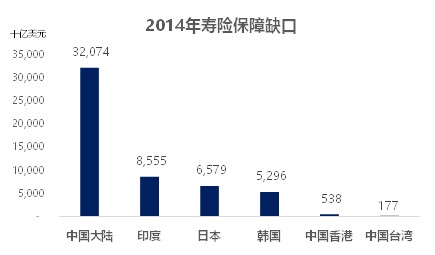
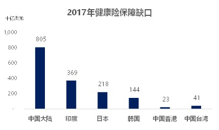

*备注1. 寿险保障缺口 = 在工作的家庭成员去世后所需资源与家属可用来维持其生活水平的现有资源之间的差额。*

*备注2. 健康险保障缺口 = 造成财务压力的自费医疗支出+因支付能力有限而未治疗的费用估值，其中造成财务压力是指人们不得不：1)削减可支配支出(例如，购买更便宜的日 常用品、减少奢侈品消费)；2)减少储蓄；3)向银行/家人/朋友借钱；4)削减必需品开销(例如，学费、日常用品、水电费支出等)。*

### 2. 中国保险业个税优惠缺失，政策调整带来的潜在保费增量巨大

**当前中国养老金和健康险保费基本无实质性的个税优惠。预计中国相关的税收政策未来大概率会有调整，这将触发养老金和健康险市场的真正爆发。**

财政部和银保监会曾推出税优健康险（2016年）和税延养老年金试点（2018年），但是由于抵扣额度过小且附加抵扣条件较多，并无实质性的突破。目前政府对于基本社保的养老和医疗系统的未来巨大财政压力有一定认知，因此商业保险获得实质性个税优惠是未来5年内的大概率事件。

当下我国养老保险体系有三大支柱，一是政府承担的基本养老保险，二是企业年金、职业年金，三是个人商业保险。截至2018年，我国基本养老保险费占比达90%，第二、第三支柱保费占比仅合计10%。对比发达国家通行的养老保障体系，政府承担的社会基本养老保险占比往往远低于企业年金、职业年金和个人商业保险占比。倘若能加大税延养老保险优惠力度，可以加快发展商业养老保险，增加养老资产、改善养老金体系存在的结构失衡、缓解基本养老保险的可持续压力以及弥补企业年金发展的不足，推进养老保障体系向“三大支柱”支撑协调迈进。

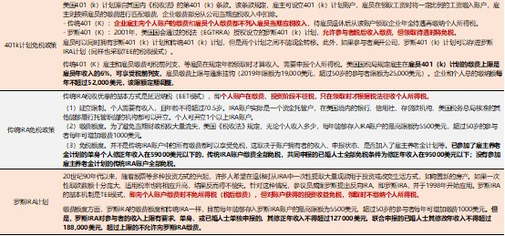

**在任何国家，个税优惠政策永远是保险行业和养老储蓄规模最主要的驱动力。**例如，美国在1970年代相继立法推出了享受个险递延优惠的401K和IRA计划，直接驱动了美国的养老储蓄市场开始快速增长。如果中国给予类似美国的个税优惠额度（RMB20000元/年），则养老储蓄市场每年的增量资金为1.5-2万亿元/年，规模接近目前正过寿险行业的保费。

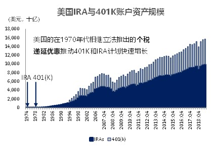

### 3. 中国健康险市场目前以重疾险为主，预计报销行医疗险未来有带来巨大增量

**中美不同的医疗体系和保障制度设计导致了健康险行业形态的巨大差异，中国健康险以重疾险为主，美国健康险以报销型医疗险为主。在中国健康险市场里，报销型医疗险将在重疾险增长放缓后带来巨大增量**

- 中国医疗资源提供方主要为公立医院，价格较低，由于主要支付方为政府，且医疗资源的需求远大于供给，保险公司无法有效控费，间接导致了难以实现承保盈利。中国社保体系以政府提供的普惠型医疗保障为主，设计思路为20万以内的费用大部分政府承担，20万以上政府承担很少，因此目前主流的商业健康险产品为重疾险（重大疾病导致20万以上的费用需要个人自己寻求商业保险的保障，如重疾险）。

- 美国医疗资源提供方以私立机构为主，价格很高，但是由于主要支付方为保险公司而不是政府（政府只给弱势群体和老年人提供基本医疗保障），保险公司具备很强的控费能力，可以实现承保盈利。美国医疗保障体系以商业保险为主（政府会补贴保险公司，亦对商业保险的费率和承保有限制），因此以报销型医疗险为主的商业健康险规模巨大。

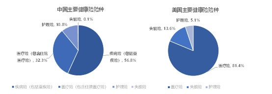

中国的健康险目前主要是重疾险（占比70%以上），报销型医疗险发展缓慢，这与发达国家市场正好相反（报销型医疗险为主流产品，重疾险是非主流产品）。这一现状主要是中国社保体系基本设计思路、代理人的销售能力、客户的偏好共同决定的。

随着中国基本社保财政压力持续扩大，医疗费用中政府支付的比例中将下降，报销型医疗险的刚性需求将真正开始增长，同时监管政策的放松（如新版健康险管理办法）和代理人销售能力的提升将使得这类产品的供给也开始提升。**长期来看，报销型医疗险将在重疾险增长放缓后迎来较大的增量空间。**

2018年中国健康险保费约为5400亿元，其中，保险型医疗险约为1000-5000亿元，其余为重疾险。在考虑了重疾险对需求的挤占后，我们静态测算中国报销型医疗险的市场空间在5000-7000亿元/年，约为目前寿险行业保费的25%-35%。

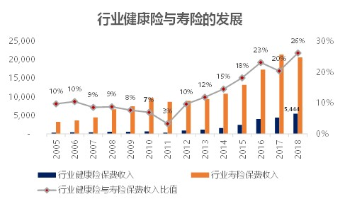

### 4. 被银行理财产品挤占市场的长期储蓄类保单，在政策利好下预期释放潜力

**相比于银行理财产品，中国储蓄类保单收益率并无明显优势且期限过长，导致被银行理财产品间接挤占了市场。**中国特色的银行理财产品隐形刚兑，收益率较高且期限较短（以3-6个月为主）。而中国的储蓄类保单虽有明确刚兑，但是收益率并无明显优势（3%-4%）且期限过长（5年以上返本），相对于银行理财完全无吸引力。

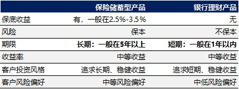

相比之下，发达国家几乎没有类似于中国银行理财的零售金融产品，居民的长期储蓄和理财需求大部分由税优养老金账户和储蓄类保单所吸收。与发达国家比较，中国保险和养老金仅占居民金融资产的6%（2016年），而美国30%（2018年）、日本28%（2017年）。由此可见，中国储蓄类保险市场并未发展充分。

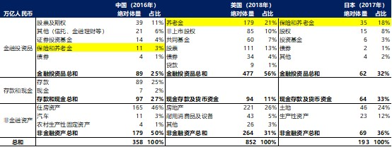

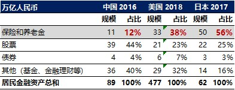

**寿险产品和银行理财监管要求的变化时常带来中周期的干扰。**中国储蓄类保单的需求主要取决于寿险和银行理财面对的监管要求的边际变化，这些变化在中周期直接影响保险行业保费的增速。

+ 2013-2016年的寿险产品快速放松促进了保险行业FYP快速提升，而2017年的一系列限制短久期储蓄类保单的规定间接导致了2018-2019年行业新单的负增长和部分中小公司的流动性困难，2h2017至今行业FYP快速收紧。

+ 2018年的资管新规（禁止期限错配将打破刚兑）加强了对银行理财的限制，客观上有利于储蓄类保单的需求的恢复，但是至今还没有严格执行。

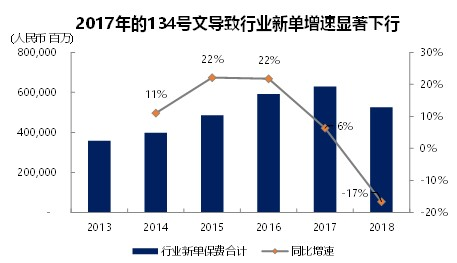

### 5. 以自有代理人渠道作为主导地位，有利于促进市场规模增长

**中国保险目前的发展阶段决定了代理人仍将是最重要的渠道。**在多数发达市场，独立中介和银保渠道是主导渠道。而在中国，自有代理人渠道占据绝对主导地位，行业个险渠道新业务价值占比处于较高水平（代理人渠道NBV占比近90%）。我们认为在未来10年自有代理人渠道的主导地位不会改变。

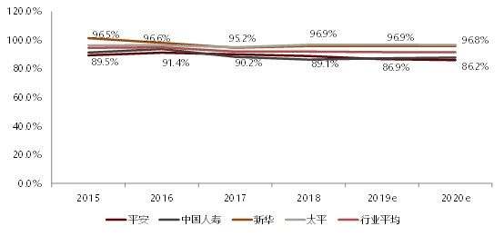

- 当前中国寿险公司普遍采用金字塔型的代理人结构，即更高层级的代理人管理多个较低层级的代理人，并且层级数量较多。金字塔型的结构构建了严密且庞大的销售体系，有利于通过不断激励增援和淘汰最底层的代理人来指数式增长接触到潜在客户的机会。
- 当前中国大多数地区保险渗透程度依然很低（多数居民没有第一张保单）且居民尚无主动保障意识，利用这种金字塔型代理人结构来放大接触到潜在客户的机会是这一阶段市场最有效的增长手段。

## 二、 保险股的投资收益来源，依次是EV滚动增长、股市beta、企业分红

基于保险股的PEV估值方法，P=EV*（P/EV）。考虑到分红在股票估值过程中会起到作用，将持有股票的受益拆分为EV滚动增长、企业分红、企业估值（P/EV），其中估值P/EV可进一步拆分为股市因素（大盘）和企业自身因素（其他）。

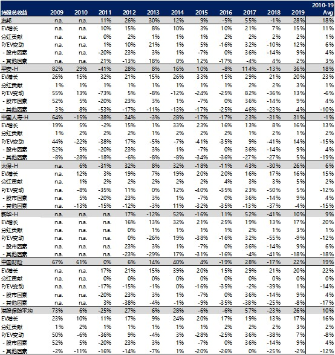

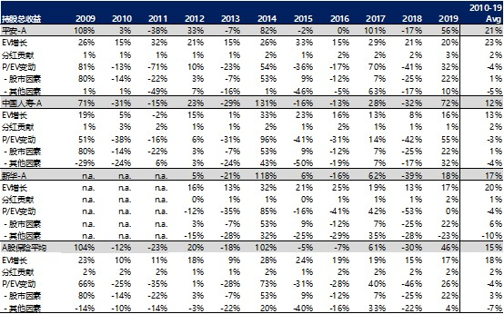

### 收益来源1：内含价值的滚动增长

**内含价值每年的滚动增长一直是持有保险股收益的最主要的驱动因素。**尽管在12个月内维度，股价经常与当年内含价值增长背离，但是在36个月以上的时间周期，股价和内涵价值增长的趋势十分一致。2010年至今H/A各公司平均内含价值累计增长159%/171%，其股价累计增长73%/114%。

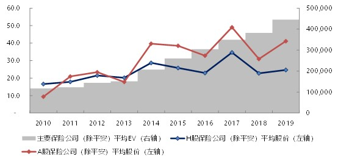

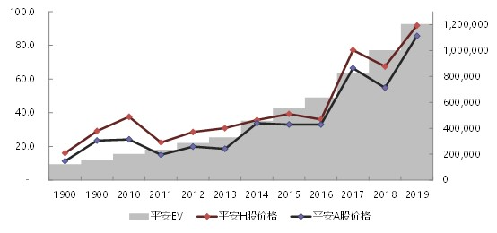

### 收益来源2：A股市场带来的beta

**由于保险公司投资的股票资产在体量上相当于净资产，保险公司具有高beta特性。**在A股整体有较大上涨的年份，投资保险股可赚取高额的相对收益。如2014年上证指数上涨53%，A股保险公司相对指数平均收益为49%。（在A股有较大下跌的年份，投资保险股的收益也不容乐观，这表明保险股的防御性十分有限。）因此，高beta特性使得投资保险股的收益会显著受到股市表现的影响。

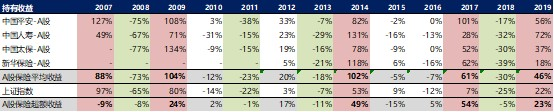

### 收益来源3：企业分红

**2009年以来，H/A保险股分红贡献的回报累计为20%/23%，且近年来持续提升，分红的重要性将越来越高。**

在过去二十年里，中国保险市场有巨大成长性，保险企业通常将大部分利润留存在公司以支撑新业务增长的需求，因此分红比例（20%-50%）和股息率（2%-3%）较低。但是在未来，分红率很可能将会继续提升，分红的重要性将越来越高，这是由于：

+ 业务规模增速放缓，保险公司可以将更多的资本用于分红（无须预留较多资本支持未来业务扩张），有利于分红率继续提升。
+ 2019年财政部要求下属国有保险公司开始提高分红比例，分红率继续提升。
+ 由于增长放缓，P/EV扩张空间有限，因此分红收益在投资收益中的影响力相对提升。

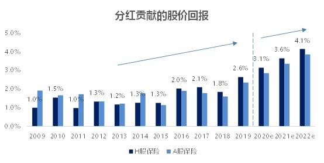

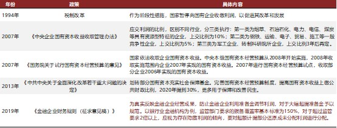

## 三、 从绝对估值和相对估值分析，保险行业长期估值中枢下行空间有限

### 1. 绝对估值：保险股当前估值已包含悲观假设和悲观预期

**从绝对估值角度来看，当前估值已经隐含较为极端的悲观假设。**即使考虑是所有的内含价值和新业务价值计算中的水分，包括投资收益率假设过高、发病率假设不足、资本计提不足、非标违约，A股保险股（平安除外）的合理估值也应高于当前平均0.9xP/EV；H股中资保险股的合理估值也大幅高于当前股价（平安H股除外）。

当下，A股保险企业的平均PEV为0.83，平安A股1.09 、国寿A股0.86 、太保A股0.74 、新华A股0.64；H股保险企业的平均PEV为0.76，友邦一枝独秀1.83、平安H股1.02、国寿H股0.45、太保H股0.52、新华H股0.38、太平0.35。综上，A股和H股的PEV在0.8的水平，其中只有友邦、平安A/H的PEV能高于1.0的水平。从绝对估值角度来看，当前保险股的价格很可能是被低估了。

**从市场预期角度来看，“利率下行+增长放缓”的悲观预期已经大部分被定价。**过去10年保险股历史估值中枢不断下移，主要由于：1）保险行业的高成长预期向下调整；2）对于未来长端利率下行的担忧。由于18年至今，新单保费持续疲弱+利率波动下行，这两个变量目前已经大部分被市场定价，额外边际影响很有限。因此，当前价格已经包含了悲观的预期。

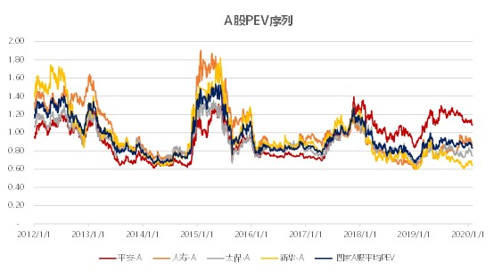

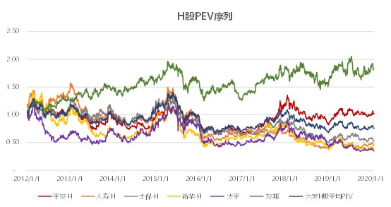

### 2. 相对估值：相对海外保险和A股其他板块，保险股下行空间也有限

从相对估值角度来看，保险股下行空间也有限。

+ 相对于海外保险公司，中国保险公司的绝对估值水平已经不高；
+ 相比于A股其他板块，保险股的估值（P/B或P/E）并不高。

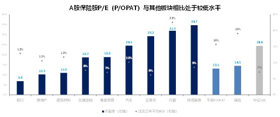

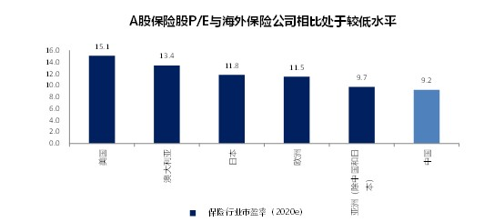

## 四、 估值框架变迁，以营运利润为估值基础将利好保险股价值重估，推荐中国平安和友邦

### 1. 寿险市场高速增长期结束，内含价值估值基础（P/EV）有局限性

**寿险市场高速增长期的结束将带来估值方法的变化。**一方面，近年来中国寿险市场总保费增速放缓，接近成熟市场水平。另一方面，2017年以来中国主要上市保险公司（以平安为例）的产品结构开始稳定。这表明，中国寿险市场的发展正从高速发展期转向成熟期。而近年来，中国上市寿险公司分红率有所提升，但相对成熟市场仍有提升空间。

我们将中国寿险市场的发展分为两个阶段，这两个阶段将分别对应不同的估值方法：

+ 高速发展期（第一阶段）：保费规模高速扩张、业务结构剧烈变化、股东分红比例很低。市场关注未来成长空间（未来新业务价值），因此以内含价值为估值基础，分红对估值影响有限。
+ 成熟期（第二阶段）：保费规模低增长或无增长、业务结构较为稳定、股东分红比例较高。市场关注公司的盈利，因此以营运利润/净利润为估值基础，同时由于关注稳定现金收益的投资者比例提升，分红的重要性大幅提升。

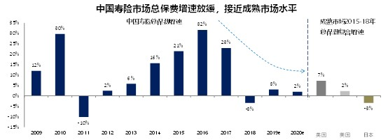

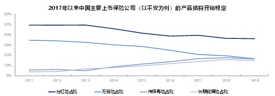

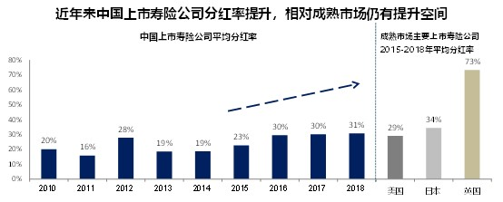

**在寿险市场的成熟期，内含价值估值基础（P/EV）有局限性。**在寿险市场的成熟期，股东更注重存量业务的盈利能力和分红，而内含价值在这方面有局限性：

+ 内含价值/新业务价值只能体现未来数年盈利折现到现在总和，无法体现每年公司的盈利；
+ 内含价值无法直接体现公司在过去一年的运营效率（是否有正的运营偏差），只能在内含价值的变动分析中间接体现；
+ 内含价值/新业务价值体系无法提供一个稳定性高且可预测的指标，用以和股东分红挂钩，限制了对于注重分红的投资者的估值参考意义。

### 2. 中国寿险市场进入成熟期，估值体系变化，盈利和分红重要性将持续提升

**中国寿险市场进入成熟期，估值体系将发生变化，盈利和分红重要性将持续提升。**

在市场高速成长期，以平安为例，剩余边际摊销（盈利的指标之一）增速的变化显著滞后于新业务价值的增长；另外，在市场高速成长期即使存量剩余边际相同，不同的业务结构就会使一家公司营运利润的产生节奏大不相同，因此以内含价值作为估值基础要比用盈利作为估值基础更为合理。

动态来看，随着中国寿险市场进入成熟期，当新业务价值增速逐渐稳定，其与营运利润增速的相关性也将更高，因此采取盈利作为估值基础具有合理性。过往以内含价值/新业务（体现未来远期的现金流和成长性）为基础的估值体系将随之发生变化，盈利和分红（现金收益）在估值体系中重要性将持续提升。以友邦为例，营运利润直接决定了分红。随着估值体系更加关注利润/营运利润，中国寿险公司的高盈利能力将会更好的被市场定价（内含价值估值基础带来的估值折价逐渐消除），同时分红水平的提升也将有利于保险股估值提升。以友邦为例，营运利润直接决定了分红。

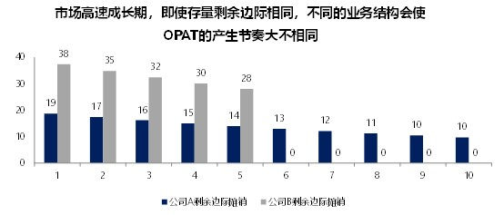

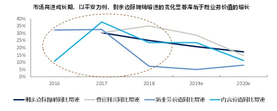

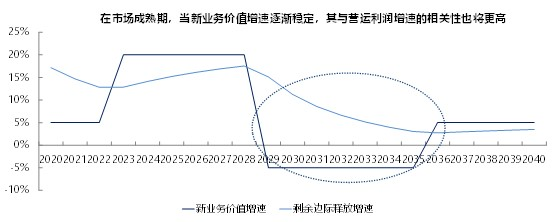

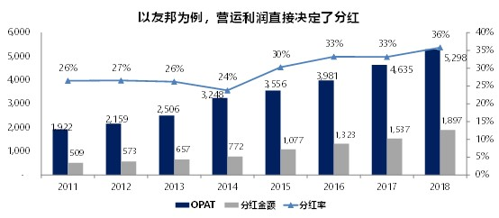

当以运营利润为估值基础后，保险股的估值将会发生以下变化：

- **促进折价的消除。**营运利润本质上是利润，因此更易于投资者理解，我们认为这将有助于消除长期以来保险股由于业务模式复杂以及内含价值体系的不透明所导致的估值折价。
- **增强横向可比性。**这将推动保险股估值与非金融行业具备横向可比性。寿险公司的高盈利性将被反映到股价，从而提高现有估值水平（目前中国保险公司P/E或P/OPAT长期显著低于平均水平）。
- **提升分红预期的影响力。**随着分红对于保险股的投资的重要性大幅提升，估值将更加直接反映分红预期的边际变化。

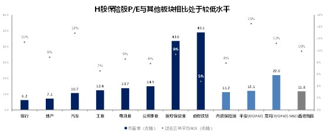

**分红水平或成为辅助的估值指标。**分红水平的提升将有效提升估值水平：

- 投资保险股的日常现金流回报提升，可吸引更多关注现金流回报的长期投资者。
- 现金分红可以提升寿险公司财务指标和资产负债表的可信度。
- P/EV<1，现金分红对估值有直接提振作用。

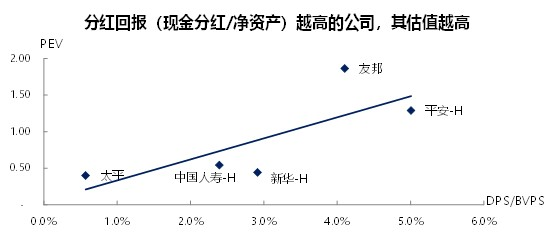

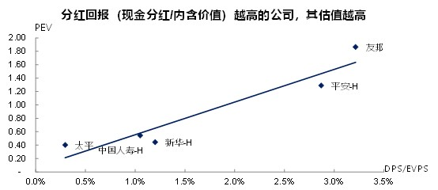

**中英分红对比，较高的分红使投资的获利方式更加清晰。**以英国寿险公司为例，较高的现金分红率支撑估值水平。较高的分红使投资的获利方式更加清晰：2017-19年，投资H股上市中国寿险公司的收益仅12%来自于分红，而英国上市寿险公司的公司的数字则为86%。

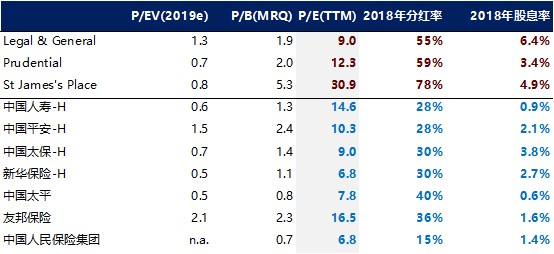

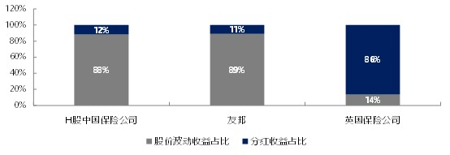

### 3. 未来看好中国平安和友邦的估值

**未来看好中国平安和友邦的估值。**未来估值的驱动因素将与现在不同，除了传统的盈利能力指标之外（ROEV、新业务价值增速、ROE），具备以下特质的保险公司将有估值溢价：

+ 内含价值/盈利的长期增速；
+ 内含价值/新业务价值转化为盈利的路径清晰；
+ 盈利转化为分红的路径清晰（基于营运利润或其他稳定可预测指标的分红政策）；
+ 分红水平（现金分红/内含价值回报）高于同业；
+ 公司治理风险小；
+ 资产负债表久期错配缺口小，具有抵御长端利率下行能力。

依据上述特质，构建选股策略核心指标，未来3年推荐：平安-H/A、友邦、中国财险。其中，中国平安和友邦的PEV目前已经领先其他中国公司了。

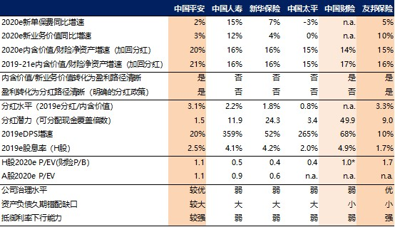

