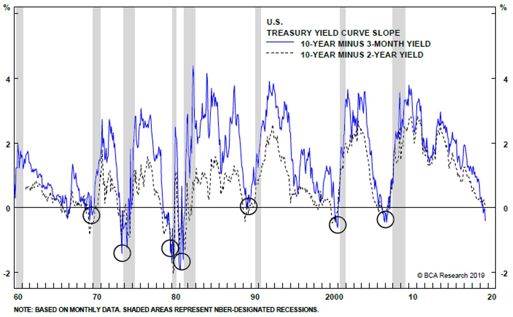
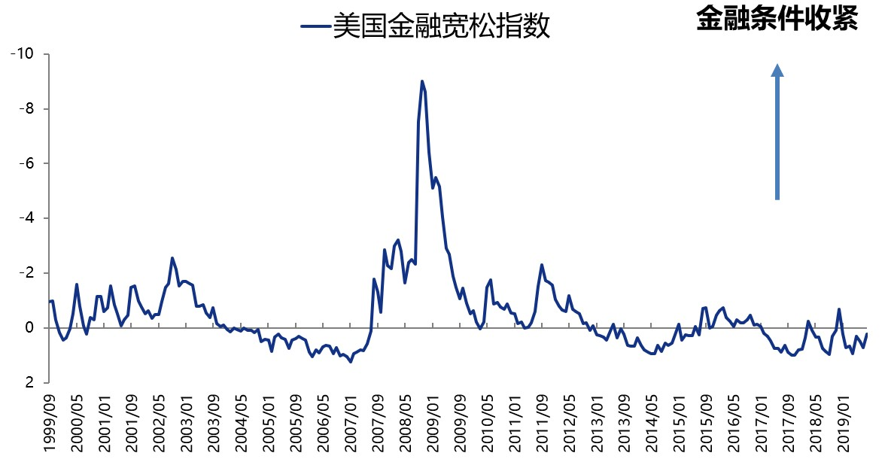
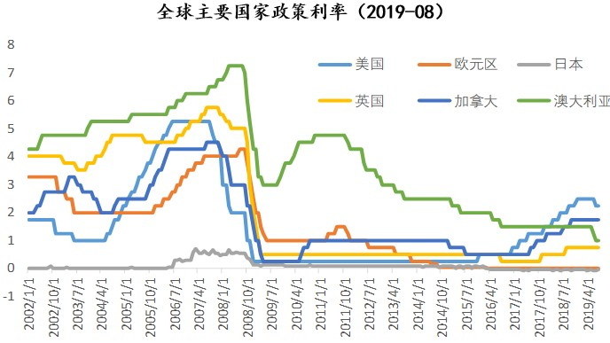
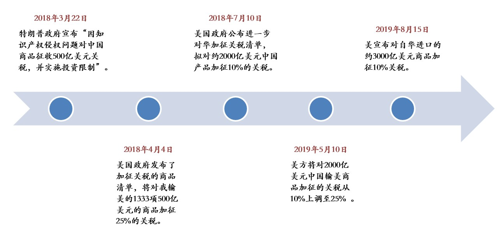
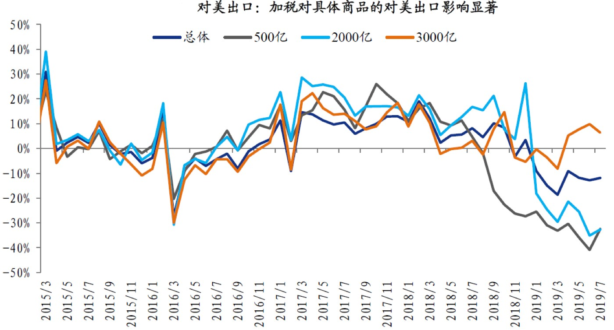
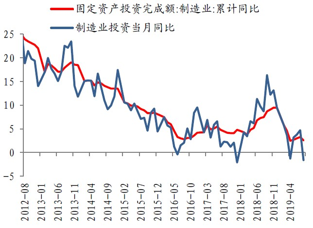
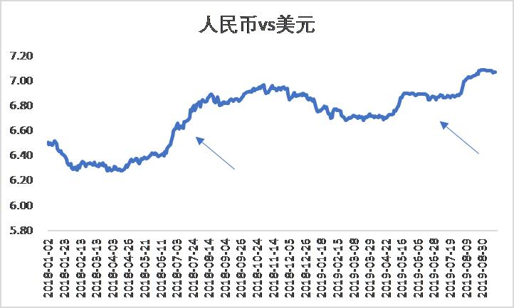
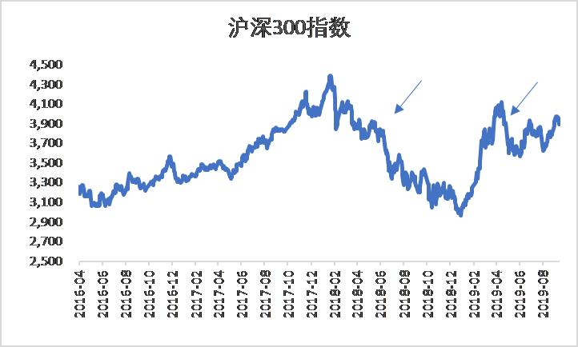
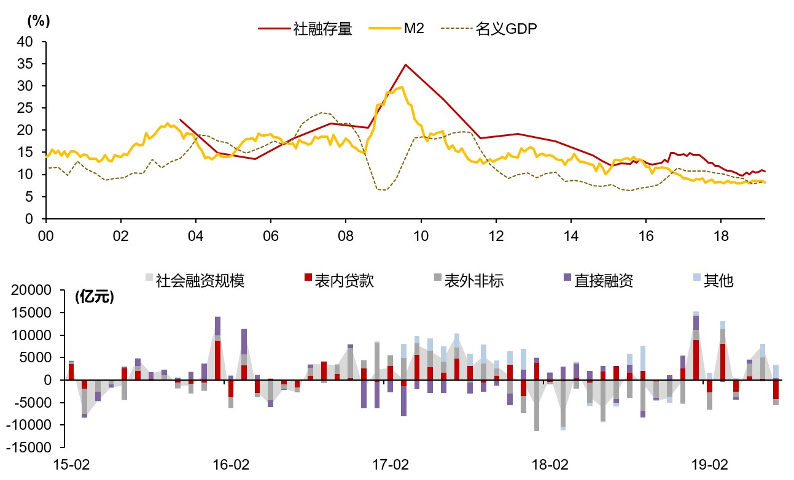
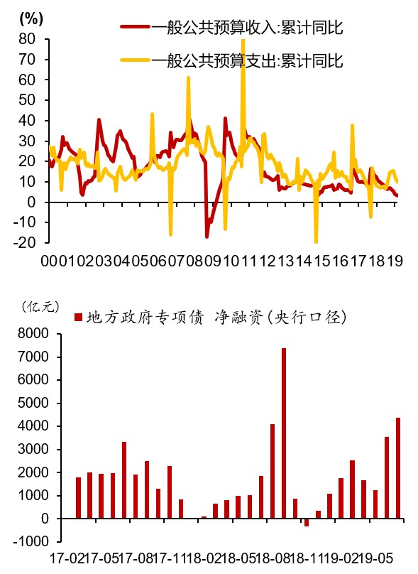

## 曲线倒挂，全球经济衰退风险上行

### 收益率曲线倒挂信号

历史上每当美债收益率曲线倒挂以后，美国经济都会陷入衰退。今年美债收益率曲线于08年金融危机后再次倒挂，包括10年利率减2年利率、10年利率减3月利率曲线倒挂，其中10年利率与2年利率的倒挂是经济危机的经典信号。

美债收益率曲线倒挂的经济学意义：短端利率如3月国债收益率和美联储的政策相关性较高，而长端利率通常与投资者对于长期债券的需求有关。如果投资者对于经济有较为强烈的悲观预期，纷纷涌入债券市场避险，并且认为这个风险会延续相当长的一段时间，那么会看多长期债券，造成长端债券价格上升、利率下降。面对这样的情况，央行通常的做法是降息，让短端的利率下来，消除倒挂的情况。

### 金融条件指数

> 金融条件指数(Financial Conditions Index，FCI)是衡量和预测一国货币政策与金融松紧状况的一项综合性参考指标，是重要的政策指示器，对实体经济有较强的预测能力，领先于宏观经济变量的变动。中国FCI综合反映了实际利率、实际有效汇率、广义货币(M2)增速、房地产市场指数和股票市场指数等五类指标。

金融条件方面，在去年年底金融大幅收紧以后，最近几个月金融条件恢复到较为宽松的区域，反应了美联储的宽松操作。Bloomberg的美国金融条件宽松指数，最近一段时间的波动性会变大，特别是在利率曲线倒挂预示着经济后周期的到来的情况下。如果金融条件突然大幅收紧，会导致实体经济下滑，而金融条件的宽松，会一定程度刺激经济但是会有一定的时滞效应。

### 全球经济状况

2018年下半年以来，全球经济同步走弱，全球PMI指数不断恶化，从2018年中的53下降至2019年中的49，其中德国的PPI恶化最为明显，从2019年开始PMI低于50，2019年7月只有43。经济恶化的背后既有中美贸易战的因素，比如德国、韩国受到贸易战的冲击比较大，在中美抗衡的摩擦里躺着中枪，同时也有也有全球流动性收紧的因素在其中。面临经济的走弱，全球央行开启新一轮宽松模式，例如在美国老大哥的带领下掀起全球降息潮、美国停止缩表、欧元区重启QE。

> 缩表是指中央银行减少资产负债表规模的行为。美联储通过直接抛售所持债券或停止到期债券再投资的方式，可实现对基础货币的直接回收，相对于提高利率，是更为严厉的紧缩政策。2008年金融危机后，美联储不仅将短期利率（联邦基金利率）降至接近零的超低水平，又先后通过三轮量化宽松货币政策购买大量美国国债和机构抵押贷款支持证券，大幅压低长期利率，以促进企业投资和居民消费，刺激美国经济复苏。美联储资产负债表的规模也从危机前的不到1万亿美元膨胀至目前的约4.5万亿美元，其数额占美国国内生产总值（GDP）的比重从约6%升至24%。美联储此前通过缩表，挤一挤金融危机后给自己加注的水分，有利于释放长期优质资产、回收投机性资金，长期来看有助于增强金融体系的稳定性。

## 贸易战风险下经济走弱,采取政策对冲

### 贸易战及其影响

直接影响：

中国对美国的出口。美国这一套加征关税的神操作下来，影响是立竿见影的：中国对美出口大幅下滑，预期未来下滑的趋势将会持续。被加征关税的500亿、2000亿、3000亿商品出口曲线的下降幅度依次增强。

间接影响：

+ 对于企业家信心的负面影响，企业利润的削减导致制造业投资的放缓；
+ 对于货币价值的影响，人民币贬值；特朗普一度怀疑中国故意让人民币贬值刺激出口从而抵消出口关税增加导致的出口量减少。
+ 对于股市的影响，A股对于贸易战新闻是有所反应的，每次加征关税，A股都会有一波下降，虽然这个反应的幅度逐渐减小了；市场上是这样形容二级分析师：一波分析猛如虎，涨跌全看特朗普。

### 国内经济趋势

国内经济下行趋势持续，但是又有企稳的迹象。最近经济企稳背后的原因是，信贷货币指标开始企稳回升。2018年表外非标的大幅缩减一定程度导致了社会融资规模的收缩，2019年随着表内贷款的提升情况有所好转。

> 社会融资规模，是指一定时期内（每月、每季或每年）实体经济从金融体系获得的全部资金总额，是全面反映金融与经济关系、金融对实体经济资金支持的总量指标。

此外，财政赤字走高，减税降费和土地出让收入的减少，加大了财政压力，而地方政府专项债将会是重要资金补充，也是中国政府目前融资的重要。

货币政策方面，从价量的角度来看都是比较宽松的，8月中旬推出的利率并轨制（央行LPR利率改革），央行对于企业的贷款利率又更强的控制了，预计宽松的趋势还将会继续持续。

> 8月16日，国常会提出要运用市场化改革办法推动实际利率水平明显降低和解决“融资难”问题等，确保实现年初确定的降低小微企业贷款综合融资成本1个百分点的任务目标。在8月17日，央行给出了实现降低1%的融资成本的方法——要通过改革LPR定价机制的方式，来给中小微企业定向降息。从8月20日开始，央行每月20日将按照新的报价机制发布贷款市场报价利率(LPR)，作为各银行新发放贷款定价的主要参考，同时作为浮动利率贷款合同的定价基准。

---

总体来看，美债收益率曲线倒挂给出了经济危机的先行信号，虽然全球的金融条件较为宽松，但是全球经济衰退风险在不断上行。贸易战的到来，使得中国对美国的商品出口首当其冲，也为未来国内外经济的发展增添了更多不确定性。当前国内经济下行趋势持续，但是信贷货币指标开始企稳回升有企稳回升迹象，预计货币政策方面宽松的趋势还将会继续持续。未来的不确定性很多，可以在乐观中加一些谨慎。