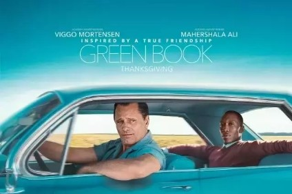
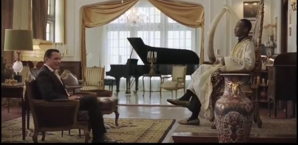
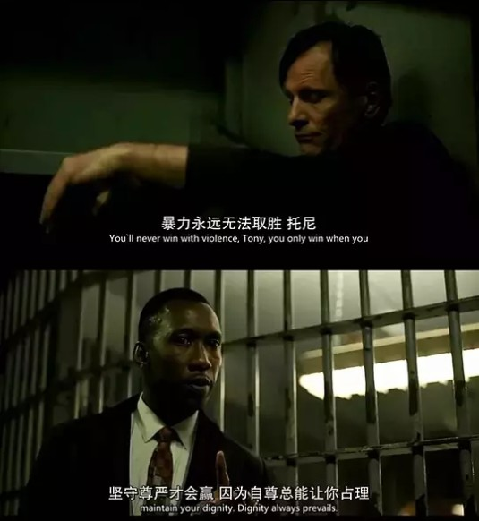
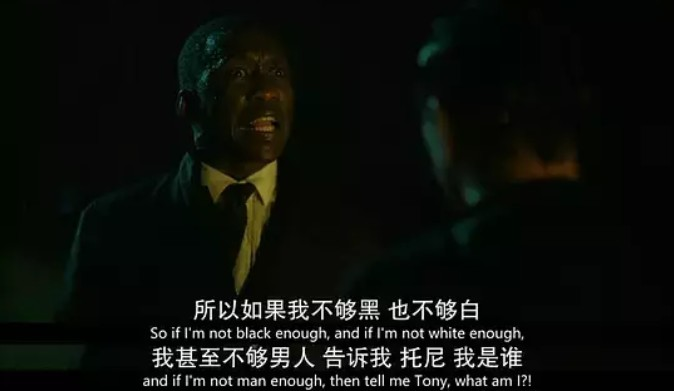
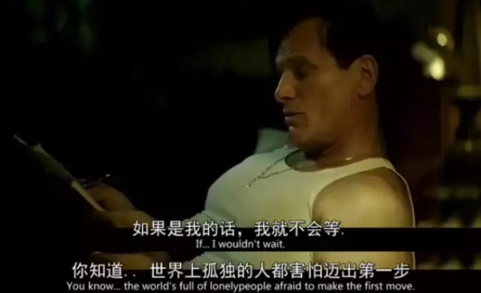
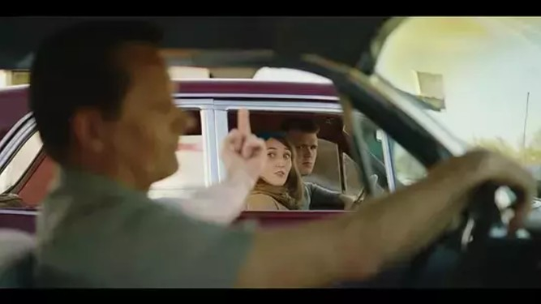
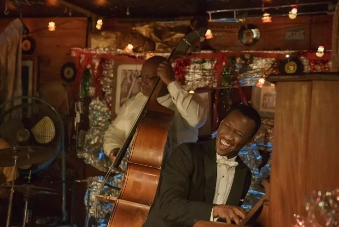

三月底，春雨淅沥，和可爱室友在论文中期答辩后决定放飞自我，酒足饭饱之际却未尽兴，于是一起就近去看了《The Green Book》。看到“论文”两个字，又想起来导师昨天给我反馈意见，这两天怕是要又要和microsoft word战斗一番了。BTW，两个月都没有更新博客主要不是因为我lazy girl，是论文占据了我大部分的时间（此处内心发出“嘿嘿嘿”的苦笑声），难道要写几篇博客纪念一下我论文从毫无头绪到被导师拉回正道再到不断修改的过程？Anyway，再接再厉，共勉！

---

**背景**

美利坚是一个主要由移民组成的民族，种族差异与权利平等的冲突会是其难以避免的问题。这部电影的背景是19世纪60年代，准确来说是1962年。首先，这是**种族歧视**根深蒂固的年代——影片名“绿皮书”事实上全称是“黑人驾驶者绿皮书”（The Negro Motorist Green Book），专门标注愿意接待黑人的旅馆、酒吧等，某种程度上可称为黑人同胞的“避难所”（如果错入白人的区域，会有生命危险）。虽然美国北部对于肤色的歧视有所削弱，但远离政治、经济中心的南方城镇却依然对黑人极其不包容，套用片中Tony Lip的一句话“越往南越危险”。但是，这也是**呼吁平等**的声音日益响亮的时期——美国黑人运动正如火如荼进行，黑人反抗意识逐渐强烈，部分白人的平等意识也逐渐觉醒。历史上，在影片故事发生的一年后即1963年，马丁·路德·金为要求通过新民权法觐见肯尼迪总统，在林肯纪念馆的台阶上，发表历史性演讲——“我有一个梦想”，呼吁给黑人平等的权利。

**故事**

Tony工作的夜总会即将停业装修，而此时他上演了一出贼喊抓贼的好戏（偷走白人贵客的帽子而后还给大佬），从而博得大佬的好感，达到“称兄道弟”的目的。至此，成功塑造Tony的圆滑、市井形象，为后来多次帮Shirley解围埋下伏笔——这是一个懂得社会规则与江湖规矩的混混。生活拮据的Tony需要在夜总会停业期寻找工作贴补家用，正是因为广结（大佬）好友，很快他收到面试的电话。

面试地点是Don Shirley（黑人钢琴家）的公寓，Tony一方面对富丽气派的装潢与摆设感到惊奇，另一方面也不卑不亢地与黑人进行讨价还价。面试过程中，黑人Shirley尊贵且儒雅地坐在金光闪闪的皇座上，而白Tony则在低一级台阶的皮椅上笑脸相迎，这一幕是有一定的视觉冲击的，因为这与黑人更为卑微的刻板印象并不相符。当Shirley提及这个“司机”一职不仅是开车与安排行程，也需要在他南下的巡回演出中当他的管家——洗衣、熨衣与擦鞋等，Tony一口回绝——开车可以，其他一律不干（他可是会将家里黑人工人喝水用过的杯子扔掉的白人啊）。最终，Shirley妥协，留人，而Tony也趁机加价，成交。很快，他们就踏上了南下演出的旅程，《绿皮书》就是这一程的指南针。

在车中小小的空间里，充斥了两种生活态度的冲突——白人Tony的随意vs黑人Shirley的自律，两层精神文化境界的冲突——白人Tony的低俗vs黑人Shirley的高贵。事实上，Tony的任务是保证将Shirley安全准时送达每一次的演出地点，只有这样他才能获取全部酬劳，否则将被扣一半的钱。而源于社会对于黑人的歧视，这一路上有很多小插曲，一次又一次的冲突使得两人的距离逐渐拉近，两人关系从利益共同体逐渐转化为互相尊重与支持——Shirley对Tony一点一点打开心扉并产生依赖，Tony对Shirley的孤独愈发理解并给予他充分的支持与保护。

一些印象较深的小插曲：

+ Shirley遭歧视而心情低落，邂逅白人男子擦出短暂的火花，也因此被逮捕——赤裸裸地被拷在地上。Tony闻讯赶去，以“贿赂”的方式使白人警察放人，但Shirley却为自尊受挫与社会不公感到失望，且对Tony的手段并不领情，二人吵架。次日Tony遇意大利裔故友，朋友用意大利语谈话并邀Tony晚上喝酒欲为其介绍更好的工作（雇主不是黑人的工作），通晓意大利语的Shirley到晚上等在门前请求Tony继续为自己工作且为二人争执道歉，而Tony坦言自己并没有打算离开而且并不会将争执的事情放在心上。
+ 一路向南，风雨交加中Tony驾车迷路，载Shirley开入禁止黑人夜晚外出的地区，白人警察称意大利裔Tony“半个黑人”导致Tony出拳打人而遭逮捕。Shirley对Tony鲁莽的表现感到愤怒，但通过请求白宫的帮助使二人得到释放。Shirley却认为这是对其身份与地位的耻辱，Tony为两人得到帮助而沾沾自喜，认为Shirley自命清高。争执之中Shirley情绪爆发，雨中带泪咆哮倾诉了他一直以来忍受的孤独与痛苦，影片达到高潮。
+ 在圣诞前夕的最后一场演出前，Shirley再次受到白人的歧视被拒绝进入餐厅进食，Shirley也因此拒绝演出，而Tony则坚定地站在Shirley的立场支持他（尽管会因此损失一半的薪酬）。考虑到Shirley还饿着肚子，二人去了黑人酒馆吃饭喝酒，而Shirley也在小酒馆里即兴演奏，点燃欢快的气氛。从Shirley的轻松愉悦的笑容与Tony的欣慰眼神看出，二人成为了真正的朋友。

在故事的结尾，鹅毛大雪中，Tony想尽快开车回纽约与家人相聚但体力不支，而Shirley为满足Tony的心愿则代其开车，将他送回家。二人分别后，Tony在饭桌上也不像从前那般口若悬河，而是安静得出奇，更是不愿意家里人将Shirley称为“Negro”而解释他是“Musician”;Shirley回住所后，不想再孤独地生活在城堡里，而手握香槟去敲开Tony住宅的门。Merry Chirstmas and Happy ending。

---

看完电影后，我觉得自己仿佛浸润在红酒里，飘飘然且意犹未尽。倘若这部电影的核心只是黑人白人结为朋友、两个肤色的人群可以平等相处这些政治正确的要素，那么并不会带来这种舒畅感。这种情感很微妙，有“四两拨千斤”的力量。回到宿舍后我回想了一下，这应该是来自认同与突破的酣畅淋漓。

从一开始，Tony与Shirley两人之间是对立的，肤色赋予了他们不公平的生存起点，而这起点的差异难以通过文化水平、物质水平去弥补——Tony作为一文盲小混混在高贵的Shirley面前没有一丝的怯懦，而位于高位皇座的Shirley却不断被Tony讨价还价。每个人物都是时代的产物，不管黑人取得多大的成就，那个时代给予黑人群体的更多都是打压与歧视。因此，我们看到的Shirley是自尊而且坚强的，因为他拥有改变这一切的决心，但是他内心深处是自卑且孤独的，因为使这一切得到改变又岂是轻而易举。他对得到尊重与公平待遇有强烈的渴望，却求而不得，所以他打造了专属的宫殿，打造了他专属的皇座——在这个城堡里，他是高贵且独特的。

但是，踏出这座宫殿，他便失去铠甲，世人的歧视与恶意伤害能使他遍体鳞伤，而他，只能凭借一副微笑的面具，去掩盖自己的眼泪与伤痕。太多的偏见与中伤，使得Shirley不得不通过伪装与自我封闭去给自己更多安全感，但长期的压抑与隐忍，终会使人不堪重负。在Shirley雨中咆哮的那一刻，我能够感受到他自尊自重背后的所有孤独与脆弱喷涌而出，他渴望被认同，被接受，甚至被爱，但是他需要去突破的已经不仅仅是社会观念的牢笼，还有一层是他内心深处自己一砖一瓦筑起的城墙。

正如Tony所言，“The world is full of lonely people afriad to make the first move.”
幸运的是，shirley最终成功跨出了那一步，而粗俗但真实的油腻中年混混Tony在这个过程里的作用不容小觑——是他，在旅程里给予了shirley越来越多的尊重与理解；是他，带着shirley打开心扉、突破城墙，让shirley知道这个世界有人愿意接纳他、站在他身边支持他。特别印象深刻的一幕是，当在南方行驶的旅途中，有人对白人Tony为黑人Shirley开车感到惊讶与鄙夷，此时Shirley显得略有不安，而Tony对他人的眼光不屑多看一眼就云淡风轻地竖起中指回击。无疑，在Tony心中，Shirley是值得尊敬的，为他开车并不是丢人的事，不值得被其他人鄙夷，所以毫不犹豫地站在Shirley的一边。可见Tony发自内心地对Shirley产生的认可，这样的情感突破了从前也戴有色眼镜的他，突破了社会设定的歧视规则，也给了Shirley足够的肯定与支持。

在旅途的八周时间里，从两个人的不断摩擦到两个人一起面对社会上的摩擦，从两个人互相对立到两个人的互相尊重与认同。在我看来，Shirley带给Tony的是精神层面的感化，仿佛是圣人于满身泥泞的社会小子的谆谆教诲，而Tony对于Shirley来说更像是一场救赎——依靠封闭内心世界获取安全感的人难以快乐，但Tony的认同与尊重化解了他的孤独与悲哀，使他得到释放真我的快乐。Tony还是那个动不动就说脏话的Tony，但是写起情书来却也变得有诗意了许多；Shirley还是那个无比自尊的Shirley，但是内心却不再孤单，尽管未来的斗争之路可能还会很长，但是Shirley知道这条路上他不再是单打独斗。

---

2019年已经过去四分之一了，今年至今没有特别自豪的事情。年度规划也发生了改变，重新陷入了迷茫，迷茫中又有点希望，哎，让我不禁感叹女人真是善变啊~下一个季度的目标，毕业论文顺利达保研标准+CFA顺利通过+好好学Python！

Best wishes~