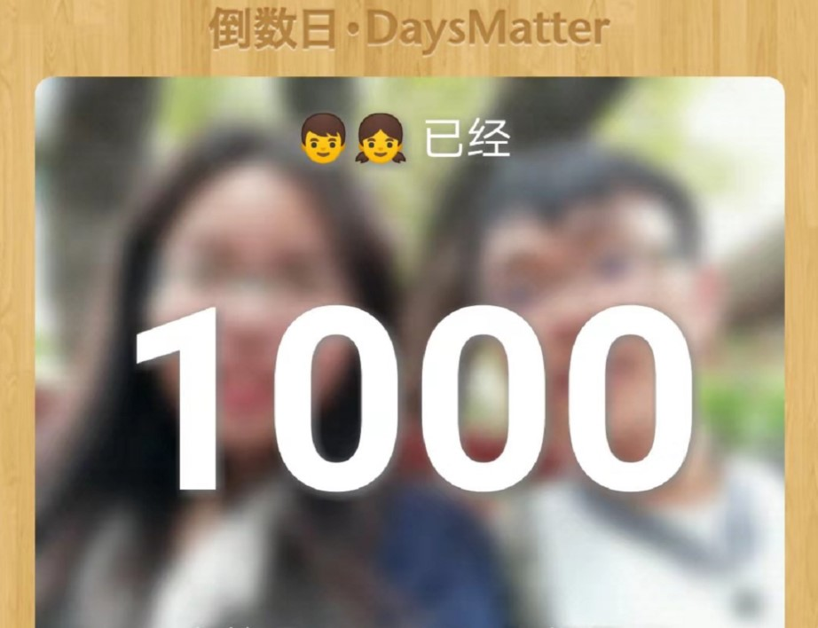
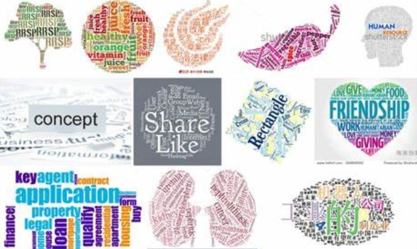
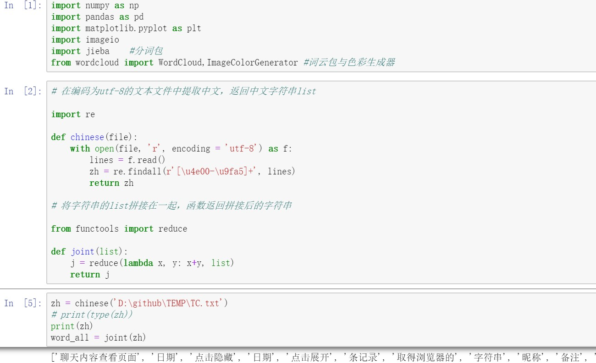
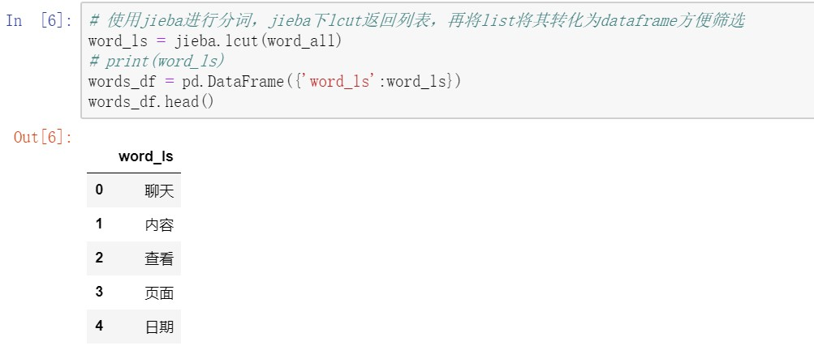
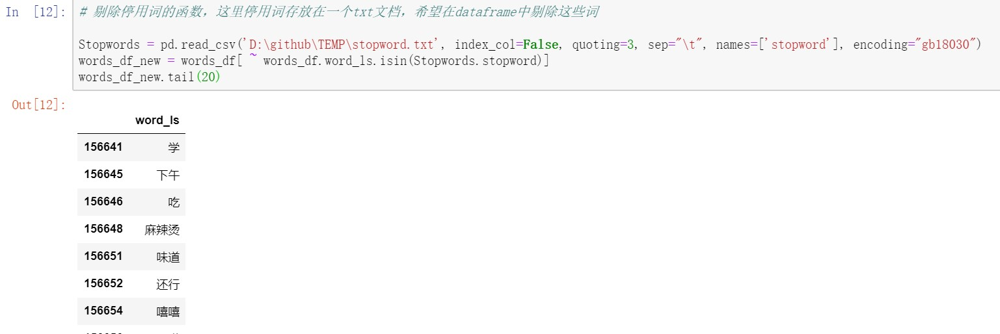
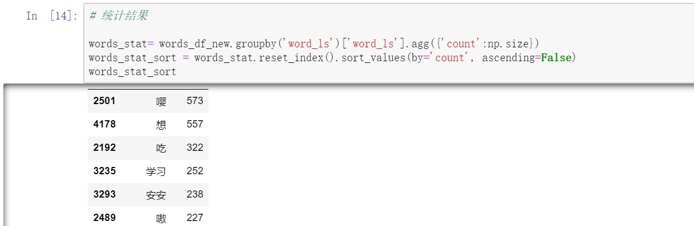
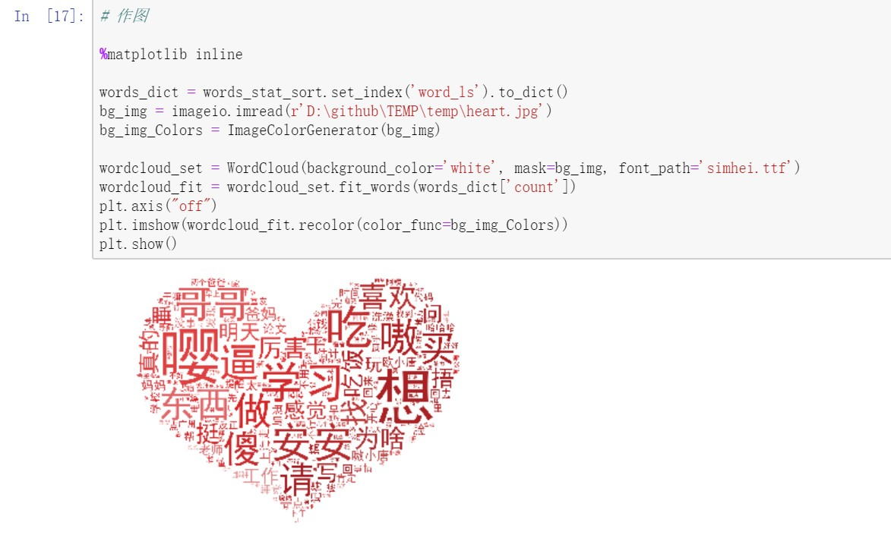

## 写在最前：今天，大日子啊

今天，是与男朋友相爱1000天的大日子！

但是，今天，也是我们异地开始的第一天（假装此处哭唧唧）……

谁能相信，在昨天我们999天纪念日这个寓意长长久久的日子，一张高铁票，把他载去了帝都！！！

虹桥高铁站的拥抱，成为我们999天纪念日的特殊回忆。

刚才问了下，今天入职的他已经开始了社畜的加班生涯了，估计没有给我准备礼物（面无表情.jpg）。Anyway，反正可以等他领到工资再好好算账（奸笑.jpg）。

最近我心里烦闷着——想好好学编程，学习量化交易，无奈技能值太弱与没有实习加强，这二者形成强有力的恶性循环，给我带来了不少烦恼。但是，人嘛，总是要向前（钱）看的，为了以后能够找到好工作，多赚钱养好自己，不能因为烦恼而停下来，而要多了解、做规划，也不要放弃自己想做的事情。冲鸭！

---

两年前的暑假，我准备去加拿大麦吉尔交换一学期，临近启程的日期恰是我最爱的七夕，他凭借程序猿的技能做了一个很漂亮的网页，以计时器的方式记录我们相爱的时间（其实刚发现网上论坛有模板欸）。那天，他是在我们互道晚安后发给我的，第二天我一大早点开的时候，演绎了一次流下真挚且感动的泪水，对他的喜爱程度上升到全新的高度。我记得很清楚，背景音乐是宋冬野的《安和桥》，在后续的日子里，每当我听到这首歌的旋律，我都会想起他，想起那个清晨，想紧紧抱住他。

在他去北京前，他注视我，突然哼起“让我再看你一眼，从南到北”。仅凭这旋律，我们都想起来之前那个网页。他突然说，“你应该给我做一个，这次我要走了”。我：？？？（少年，你怎么能有这么危险的想法！！）

其实，我内心是有过这个想法的……（可是后来毕业典礼后忙着整理照片就忘了嘿）

于是，在虹桥高铁站送别后，我怀着不悲不喜的心情，回到略有冷清的宿舍，打开电脑，潜心专注，开始……

> ## 用我们的wechat聊天记录——制作词云

### 原材料

电脑，微信，导出聊天记录的软件，python及必要的库（maybe加一个，已root手机）

### 制作目标

制作词云，如下图所示

### 制作意义

+ 这是我们日程生活的缩影，透过词云我们可以可视化双方的“甜言蜜语”，复盘一下俺们小情侣的生活轨迹
+ 这是一次女方使用编程技术的锻炼经历，能够让男方收获自己指导和鼓励等付出的感动回报

### 步骤分解

#### Step1 原始数据是所有步骤的起点

导出微信中与指定联系人的聊天记录，这是一串及其复杂的操作。如果你有苹果手机或者一部root过的手机就会变得简单很多，详见最后链接。在微信聊天记录导出后，会有一个html文件，用IE浏览器打开网页文件，将网页另存为txt文件（默认utf-8编码就不要改动了）。至此，就得到了词云制作的原材料啦。

#### Step2 读取文本文件并筛选出中文字符

在python中读取文本文件，利用正则表达从读取的内容中提取中文字符。某种程度上算作一次数据清洗，因为从网页转化过来或者是微信图片、表情什么的，会产生大量没有意义的英文字符，我们的任务是要剔除掉它们。基于我们微信聊天主要是用中文，所以只需要保留中文即可。基于中文的编码范围是：\u4e00到\u9fa5，通过正则表达加findall函数可以返回中文文本的list。

如下图，得到的“聊天内容查看页面”、“日期”、“点击隐藏”、“点击展开”等等，就是筛选出来的中文词语。

但是jieba主要是针对字符对象进行操作，上述返回的list并不方便。所以，我在这里使用reduce函数，将所有得到的list的内容（就是很多很多中文字符）重新拼接在一起，方便后续利用jieba进行分词。

#### Step3 调用jieba进行分词

jieba库中，lcut用法是在分词后返回一个词语的列表。随之，我们将分词后的list，转化成一个dataframe的形式，这样可以方便稍后的筛选（pd.dataframe进行筛选十分便利）。至于为什么又要筛选捏，因为，像下面“聊天”、“内容”、“查看”、“日期”这种分词后的内容，可是这明显就是聊天记录的模板文字嘛，也就是说这不是聊天内容，不应出现在我的词云里。所以下面一个步骤，就是引入停用词（不想要的词语），将这些词语从dataframe中剔除。

#### Step4 去除停用词

这个步骤，目标是要去掉一些常见停用词以及其他无意义的词语，比如：的，吗，呢，还有聊天记录文本里昵称、图片、语音提示等等。

我已经将这些词整理好，放在一个stopword的txt文件里，注意这个自建的txt文件编码不是utf-8了，而是gb18030。将这个文件读入生成一列名为stopword，然后就是要将步骤3的dataframe中包含这些词的行去掉。利用~取反与isin搭配（学到新技巧了！！），筛选出不包含stopword的行。至此，数据清理完成啦，剩下的都是有用的关键词啦，存放在途中words_df_new这个dataframe里。

#### Step5 统计词语出现的频次

在文本内容清洗过后，这一步进行数据统计，将样本以词语进行分组（groupby），统计每一个词语出现的频次（agg、np.size），然后排序看一下。

#### Step6 调用wordcloud进行作图

将上面得到的词语与频次数据建成字典，以词语为key，频次为value（下面worldcloud会用到，因为词语的频次决定其在图中显示的大小）。通过上述的步骤，如今，数据已经完全准备好了。

作图方面，选定一张好看的图片（这里选了红色的心形——爱你的形状！！）勾勒词云形状，利用wordcloud库对词云图进行设定，比如背景颜色、字体颜色、字体等等（具体设定蛮多的，但是有一些默认的就已经蛮好啦）。图中通过fit_words(dict['frequency'])，基于上述字典中频次决定词语字体大小。

最后就是图片的展示啦~

#### 看图说话

通过这幅图，我们看到小两口之间的对话有这些关键词:

+ **学习**（竟恰好随机出现在心形的最中间），仿佛在告诉世人，我们甜甜蜜蜜但丝毫不影响互相督促学习。多么励志的一对情侣啊！！
+ **嘤**，两个嘤嘤怪……每次撒娇打“嘤嘤嘤”，一次性增加3个频次，所以“嘤嘤嘤”的“嘤”格外大。
+ **想**，想你，我想干嘛，你想不想，噢，这么美好的一个词，配得上这美好的恋爱（害羞.jpg）
+ **安安**，嘿嘿嘿（睡前小甜蜜）
+ **嗷**，两个人都一把年纪了，总发出一些这么可爱的声音干什么！！
+ **傻**，听说小情侣之间总喜欢说对方“傻猪猪”什么的很可爱的昵称，但是我坚信，这词云里“傻”是和“逼”一起的，虽然被jieba拆开了，但仔细一看，会发现，它们，一样， 大！！！！！（哼）
+ **吃**，两个吃货，出现这个词我和他都需要承担责任（严肃脸）
+ **买**，emmm，这个，估计是我啦，突然发现自己要说出“我买了XXX”、“你去给我买XXX”、“我要买XXX”，真的很顺口耶！！！

所以，我们的生活缩影在一天里，就是：**学习、吃、买、傻逼、安安，再加点嘤嘤嘤和嗷嗷嗷跟对方撒撒娇**。

我们的生活，可爱且美好。

话说，图中右上角还有个比较大的“喜欢”。那真的很高兴诶，原来我们彼此经常分享喜爱的事物和经历。

谢谢唐先生，让我不再孤孤单单的，有个人说说话的感觉，我真的好喜欢呀！！！（“喜欢”频次+1）

---

提供一些有用的链接：

+ [本文内容附代码链接（记得把路径改掉）](https://github.com/chenjiahuan262821/chenjiahuan262821.github.io/blob/source/source/_posts/wordcloud/wordCloud.py)
+ [微信聊天记录导出指南（IOS）](https://zhuanlan.zhihu.com/p/48118211)
+ [微信聊天记录如何导出(IOS与安卓)](https://www.zhihu.com/question/66251440/answer/402371940)
+ [wordcloud文件用whl来安装](https://www.lfd.uci.edu/~gohlke/pythonlibs/)
+ [参考链接1：利用python做聊天记录词云分析](https://blog.csdn.net/lantxy2009/article/details/87527375)
+ [参考链接2：python词云实现](https://blog.csdn.net/qq_25819827/article/details/78991733)

---

写在最后：

时间真的过的好快呀，1000天好像咻的一声就过去了。可是，1000天真的好少欸，才不到3年，10000天也好少，都不到28年……反正，我觉得不够。所以，接下去的日子还请唐总继续多多关照了！

